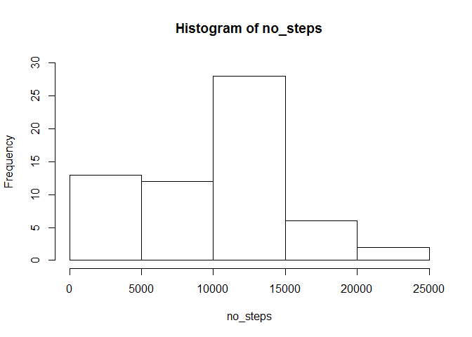
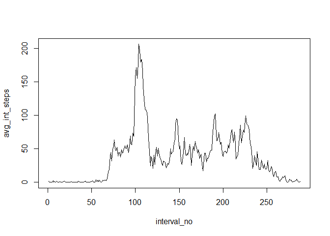
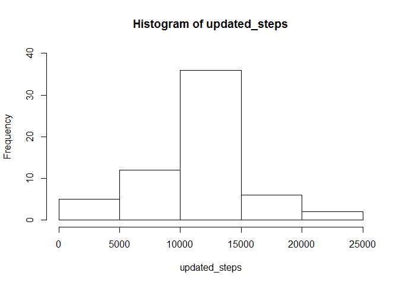
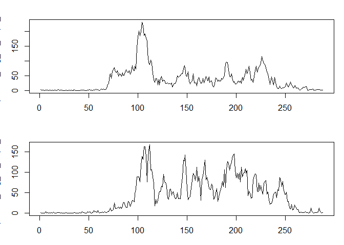

## Loading and preprocessing the data

```r
setwd("C:\\Users\\MARK\\Desktop\\Marwin Documents\\Coursera Courses\\5. Reproducible Research\\Course Project 1")
data<-read.csv("./activity.csv",sep=",",header=TRUE)
dates<-split(data,data$date)
no_steps<-sapply(dates,function(x){sum(x[,1],na.rm=TRUE)})
no_steps
```

```
## 2012-10-01 2012-10-02 2012-10-03 2012-10-04 2012-10-05 2012-10-06 2012-10-07 
##          0        126      11352      12116      13294      15420      11015 
## 2012-10-08 2012-10-09 2012-10-10 2012-10-11 2012-10-12 2012-10-13 2012-10-14 
##          0      12811       9900      10304      17382      12426      15098 
## 2012-10-15 2012-10-16 2012-10-17 2012-10-18 2012-10-19 2012-10-20 2012-10-21 
##      10139      15084      13452      10056      11829      10395       8821 
## 2012-10-22 2012-10-23 2012-10-24 2012-10-25 2012-10-26 2012-10-27 2012-10-28 
##      13460       8918       8355       2492       6778      10119      11458 
## 2012-10-29 2012-10-30 2012-10-31 2012-11-01 2012-11-02 2012-11-03 2012-11-04 
##       5018       9819      15414          0      10600      10571          0 
## 2012-11-05 2012-11-06 2012-11-07 2012-11-08 2012-11-09 2012-11-10 2012-11-11 
##      10439       8334      12883       3219          0          0      12608 
## 2012-11-12 2012-11-13 2012-11-14 2012-11-15 2012-11-16 2012-11-17 2012-11-18 
##      10765       7336          0         41       5441      14339      15110 
## 2012-11-19 2012-11-20 2012-11-21 2012-11-22 2012-11-23 2012-11-24 2012-11-25 
##       8841       4472      12787      20427      21194      14478      11834 
## 2012-11-26 2012-11-27 2012-11-28 2012-11-29 2012-11-30 
##      11162      13646      10183       7047          0
```

```r
hist(no_steps,ylim=c(0,30))
```

<!-- -->


## What is mean total number of steps taken per day?

```r
mean(no_steps)
```

```
## [1] 9354.23
```

```r
median(no_steps)
```

```
## [1] 10395
```


## What is the average daily activity pattern?

```r
data1<-transform(data,interval=factor(interval))
str(data1)
```

```
## 'data.frame':	17568 obs. of  3 variables:
##  $ steps   : int  NA NA NA NA NA NA NA NA NA NA ...
##  $ date    : Factor w/ 61 levels "2012-10-01","2012-10-02",..: 1 1 1 1 1 1 1 1 1 1 ...
##  $ interval: Factor w/ 288 levels "0","5","10","15",..: 1 2 3 4 5 6 7 8 9 10 ...
```

```r
intervals<-split(data1,data1$interval)

avg_int_steps<-sapply(intervals,function(x){mean(x[,1],na.rm=TRUE)})
str(avg_int_steps)
```

```
##  Named num [1:288] 1.717 0.3396 0.1321 0.1509 0.0755 ...
##  - attr(*, "names")= chr [1:288] "0" "5" "10" "15" ...
```

```r
length(avg_int_steps)
```

```
## [1] 288
```

```r
interval_no<-seq(1:288)
plot(interval_no,avg_int_steps,type="l")
```

<!-- -->

```r
max(avg_int_steps)
```

```
## [1] 206.1698
```

```r
which.max(avg_int_steps)
```

```
## 835 
## 104
```


## Imputing missing values

```r
sum(is.na(data))
```

```
## [1] 2304
```

```r
data2<-as.data.frame(avg_int_steps)
head(data2)
```

```
##    avg_int_steps
## 0      1.7169811
## 5      0.3396226
## 10     0.1320755
## 15     0.1509434
## 20     0.0754717
## 25     2.0943396
```

```r
data2<-mutate(data2,interval=rownames(data2))
data2
```

```
##     avg_int_steps interval
## 1       1.7169811        0
## 2       0.3396226        5
## 3       0.1320755       10
## 4       0.1509434       15
## 5       0.0754717       20
## 6       2.0943396       25
## 7       0.5283019       30
## 8       0.8679245       35
## 9       0.0000000       40
## 10      1.4716981       45
## 11      0.3018868       50
## 12      0.1320755       55
## 13      0.3207547      100
## 14      0.6792453      105
## 15      0.1509434      110
## 16      0.3396226      115
## 17      0.0000000      120
## 18      1.1132075      125
## 19      1.8301887      130
## 20      0.1698113      135
## 21      0.1698113      140
## 22      0.3773585      145
## 23      0.2641509      150
## 24      0.0000000      155
## 25      0.0000000      200
## 26      0.0000000      205
## 27      1.1320755      210
## 28      0.0000000      215
## 29      0.0000000      220
## 30      0.1320755      225
## 31      0.0000000      230
## 32      0.2264151      235
## 33      0.0000000      240
## 34      0.0000000      245
## 35      1.5471698      250
## 36      0.9433962      255
## 37      0.0000000      300
## 38      0.0000000      305
## 39      0.0000000      310
## 40      0.0000000      315
## 41      0.2075472      320
## 42      0.6226415      325
## 43      1.6226415      330
## 44      0.5849057      335
## 45      0.4905660      340
## 46      0.0754717      345
## 47      0.0000000      350
## 48      0.0000000      355
## 49      1.1886792      400
## 50      0.9433962      405
## 51      2.5660377      410
## 52      0.0000000      415
## 53      0.3396226      420
## 54      0.3584906      425
## 55      4.1132075      430
## 56      0.6603774      435
## 57      3.4905660      440
## 58      0.8301887      445
## 59      3.1132075      450
## 60      1.1132075      455
## 61      0.0000000      500
## 62      1.5660377      505
## 63      3.0000000      510
## 64      2.2452830      515
## 65      3.3207547      520
## 66      2.9622642      525
## 67      2.0943396      530
## 68      6.0566038      535
## 69     16.0188679      540
## 70     18.3396226      545
## 71     39.4528302      550
## 72     44.4905660      555
## 73     31.4905660      600
## 74     49.2641509      605
## 75     53.7735849      610
## 76     63.4528302      615
## 77     49.9622642      620
## 78     47.0754717      625
## 79     52.1509434      630
## 80     39.3396226      635
## 81     44.0188679      640
## 82     44.1698113      645
## 83     37.3584906      650
## 84     49.0377358      655
## 85     43.8113208      700
## 86     44.3773585      705
## 87     50.5094340      710
## 88     54.5094340      715
## 89     49.9245283      720
## 90     50.9811321      725
## 91     55.6792453      730
## 92     44.3207547      735
## 93     52.2641509      740
## 94     69.5471698      745
## 95     57.8490566      750
## 96     56.1509434      755
## 97     73.3773585      800
## 98     68.2075472      805
## 99    129.4339623      810
## 100   157.5283019      815
## 101   171.1509434      820
## 102   155.3962264      825
## 103   177.3018868      830
## 104   206.1698113      835
## 105   195.9245283      840
## 106   179.5660377      845
## 107   183.3962264      850
## 108   167.0188679      855
## 109   143.4528302      900
## 110   124.0377358      905
## 111   109.1132075      910
## 112   108.1132075      915
## 113   103.7169811      920
## 114    95.9622642      925
## 115    66.2075472      930
## 116    45.2264151      935
## 117    24.7924528      940
## 118    38.7547170      945
## 119    34.9811321      950
## 120    21.0566038      955
## 121    40.5660377     1000
## 122    26.9811321     1005
## 123    42.4150943     1010
## 124    52.6603774     1015
## 125    38.9245283     1020
## 126    50.7924528     1025
## 127    44.2830189     1030
## 128    37.4150943     1035
## 129    34.6981132     1040
## 130    28.3396226     1045
## 131    25.0943396     1050
## 132    31.9433962     1055
## 133    31.3584906     1100
## 134    29.6792453     1105
## 135    21.3207547     1110
## 136    25.5471698     1115
## 137    28.3773585     1120
## 138    26.4716981     1125
## 139    33.4339623     1130
## 140    49.9811321     1135
## 141    42.0377358     1140
## 142    44.6037736     1145
## 143    46.0377358     1150
## 144    59.1886792     1155
## 145    63.8679245     1200
## 146    87.6981132     1205
## 147    94.8490566     1210
## 148    92.7735849     1215
## 149    63.3962264     1220
## 150    50.1698113     1225
## 151    54.4716981     1230
## 152    32.4150943     1235
## 153    26.5283019     1240
## 154    37.7358491     1245
## 155    45.0566038     1250
## 156    67.2830189     1255
## 157    42.3396226     1300
## 158    39.8867925     1305
## 159    43.2641509     1310
## 160    40.9811321     1315
## 161    46.2452830     1320
## 162    56.4339623     1325
## 163    42.7547170     1330
## 164    25.1320755     1335
## 165    39.9622642     1340
## 166    53.5471698     1345
## 167    47.3207547     1350
## 168    60.8113208     1355
## 169    55.7547170     1400
## 170    51.9622642     1405
## 171    43.5849057     1410
## 172    48.6981132     1415
## 173    35.4716981     1420
## 174    37.5471698     1425
## 175    41.8490566     1430
## 176    27.5094340     1435
## 177    17.1132075     1440
## 178    26.0754717     1445
## 179    43.6226415     1450
## 180    43.7735849     1455
## 181    30.0188679     1500
## 182    36.0754717     1505
## 183    35.4905660     1510
## 184    38.8490566     1515
## 185    45.9622642     1520
## 186    47.7547170     1525
## 187    48.1320755     1530
## 188    65.3207547     1535
## 189    82.9056604     1540
## 190    98.6603774     1545
## 191   102.1132075     1550
## 192    83.9622642     1555
## 193    62.1320755     1600
## 194    64.1320755     1605
## 195    74.5471698     1610
## 196    63.1698113     1615
## 197    56.9056604     1620
## 198    59.7735849     1625
## 199    43.8679245     1630
## 200    38.5660377     1635
## 201    44.6603774     1640
## 202    45.4528302     1645
## 203    46.2075472     1650
## 204    43.6792453     1655
## 205    46.6226415     1700
## 206    56.3018868     1705
## 207    50.7169811     1710
## 208    61.2264151     1715
## 209    72.7169811     1720
## 210    78.9433962     1725
## 211    68.9433962     1730
## 212    59.6603774     1735
## 213    75.0943396     1740
## 214    56.5094340     1745
## 215    34.7735849     1750
## 216    37.4528302     1755
## 217    40.6792453     1800
## 218    58.0188679     1805
## 219    74.6981132     1810
## 220    85.3207547     1815
## 221    59.2641509     1820
## 222    67.7735849     1825
## 223    77.6981132     1830
## 224    74.2452830     1835
## 225    85.3396226     1840
## 226    99.4528302     1845
## 227    86.5849057     1850
## 228    85.6037736     1855
## 229    84.8679245     1900
## 230    77.8301887     1905
## 231    58.0377358     1910
## 232    53.3584906     1915
## 233    36.3207547     1920
## 234    20.7169811     1925
## 235    27.3962264     1930
## 236    40.0188679     1935
## 237    30.2075472     1940
## 238    25.5471698     1945
## 239    45.6603774     1950
## 240    33.5283019     1955
## 241    19.6226415     2000
## 242    19.0188679     2005
## 243    19.3396226     2010
## 244    33.3396226     2015
## 245    26.8113208     2020
## 246    21.1698113     2025
## 247    27.3018868     2030
## 248    21.3396226     2035
## 249    19.5471698     2040
## 250    21.3207547     2045
## 251    32.3018868     2050
## 252    20.1509434     2055
## 253    15.9433962     2100
## 254    17.2264151     2105
## 255    23.4528302     2110
## 256    19.2452830     2115
## 257    12.4528302     2120
## 258     8.0188679     2125
## 259    14.6603774     2130
## 260    16.3018868     2135
## 261     8.6792453     2140
## 262     7.7924528     2145
## 263     8.1320755     2150
## 264     2.6226415     2155
## 265     1.4528302     2200
## 266     3.6792453     2205
## 267     4.8113208     2210
## 268     8.5094340     2215
## 269     7.0754717     2220
## 270     8.6981132     2225
## 271     9.7547170     2230
## 272     2.2075472     2235
## 273     0.3207547     2240
## 274     0.1132075     2245
## 275     1.6037736     2250
## 276     4.6037736     2255
## 277     3.3018868     2300
## 278     2.8490566     2305
## 279     0.0000000     2310
## 280     0.8301887     2315
## 281     0.9622642     2320
## 282     1.5849057     2325
## 283     2.6037736     2330
## 284     4.6981132     2335
## 285     3.3018868     2340
## 286     0.6415094     2345
## 287     0.2264151     2350
## 288     1.0754717     2355
```

```r
nrow(data2)
```

```
## [1] 288
```

```r
int<-as.numeric(data2$interval)

for(j in 1:288){
		for(i in 1:61){
			if(is.na(data1[data1$interval==int[j],]$steps[i])){
		data1[data1$interval==int[j],]$steps[i]<-data2[data2$interval==int[j],]$avg_int_steps
			}	
		}
	}
head(data1,100)
```

```
##           steps       date interval
## 1     1.7169811 2012-10-01        0
## 2     0.3396226 2012-10-01        5
## 3     0.1320755 2012-10-01       10
## 4     0.1509434 2012-10-01       15
## 5     0.0754717 2012-10-01       20
## 6     2.0943396 2012-10-01       25
## 7     0.5283019 2012-10-01       30
## 8     0.8679245 2012-10-01       35
## 9     0.0000000 2012-10-01       40
## 10    1.4716981 2012-10-01       45
## 11    0.3018868 2012-10-01       50
## 12    0.1320755 2012-10-01       55
## 13    0.3207547 2012-10-01      100
## 14    0.6792453 2012-10-01      105
## 15    0.1509434 2012-10-01      110
## 16    0.3396226 2012-10-01      115
## 17    0.0000000 2012-10-01      120
## 18    1.1132075 2012-10-01      125
## 19    1.8301887 2012-10-01      130
## 20    0.1698113 2012-10-01      135
## 21    0.1698113 2012-10-01      140
## 22    0.3773585 2012-10-01      145
## 23    0.2641509 2012-10-01      150
## 24    0.0000000 2012-10-01      155
## 25    0.0000000 2012-10-01      200
## 26    0.0000000 2012-10-01      205
## 27    1.1320755 2012-10-01      210
## 28    0.0000000 2012-10-01      215
## 29    0.0000000 2012-10-01      220
## 30    0.1320755 2012-10-01      225
## 31    0.0000000 2012-10-01      230
## 32    0.2264151 2012-10-01      235
## 33    0.0000000 2012-10-01      240
## 34    0.0000000 2012-10-01      245
## 35    1.5471698 2012-10-01      250
## 36    0.9433962 2012-10-01      255
## 37    0.0000000 2012-10-01      300
## 38    0.0000000 2012-10-01      305
## 39    0.0000000 2012-10-01      310
## 40    0.0000000 2012-10-01      315
## 41    0.2075472 2012-10-01      320
## 42    0.6226415 2012-10-01      325
## 43    1.6226415 2012-10-01      330
## 44    0.5849057 2012-10-01      335
## 45    0.4905660 2012-10-01      340
## 46    0.0754717 2012-10-01      345
## 47    0.0000000 2012-10-01      350
## 48    0.0000000 2012-10-01      355
## 49    1.1886792 2012-10-01      400
## 50    0.9433962 2012-10-01      405
## 51    2.5660377 2012-10-01      410
## 52    0.0000000 2012-10-01      415
## 53    0.3396226 2012-10-01      420
## 54    0.3584906 2012-10-01      425
## 55    4.1132075 2012-10-01      430
## 56    0.6603774 2012-10-01      435
## 57    3.4905660 2012-10-01      440
## 58    0.8301887 2012-10-01      445
## 59    3.1132075 2012-10-01      450
## 60    1.1132075 2012-10-01      455
## 61    0.0000000 2012-10-01      500
## 62    1.5660377 2012-10-01      505
## 63    3.0000000 2012-10-01      510
## 64    2.2452830 2012-10-01      515
## 65    3.3207547 2012-10-01      520
## 66    2.9622642 2012-10-01      525
## 67    2.0943396 2012-10-01      530
## 68    6.0566038 2012-10-01      535
## 69   16.0188679 2012-10-01      540
## 70   18.3396226 2012-10-01      545
## 71   39.4528302 2012-10-01      550
## 72   44.4905660 2012-10-01      555
## 73   31.4905660 2012-10-01      600
## 74   49.2641509 2012-10-01      605
## 75   53.7735849 2012-10-01      610
## 76   63.4528302 2012-10-01      615
## 77   49.9622642 2012-10-01      620
## 78   47.0754717 2012-10-01      625
## 79   52.1509434 2012-10-01      630
## 80   39.3396226 2012-10-01      635
## 81   44.0188679 2012-10-01      640
## 82   44.1698113 2012-10-01      645
## 83   37.3584906 2012-10-01      650
## 84   49.0377358 2012-10-01      655
## 85   43.8113208 2012-10-01      700
## 86   44.3773585 2012-10-01      705
## 87   50.5094340 2012-10-01      710
## 88   54.5094340 2012-10-01      715
## 89   49.9245283 2012-10-01      720
## 90   50.9811321 2012-10-01      725
## 91   55.6792453 2012-10-01      730
## 92   44.3207547 2012-10-01      735
## 93   52.2641509 2012-10-01      740
## 94   69.5471698 2012-10-01      745
## 95   57.8490566 2012-10-01      750
## 96   56.1509434 2012-10-01      755
## 97   73.3773585 2012-10-01      800
## 98   68.2075472 2012-10-01      805
## 99  129.4339623 2012-10-01      810
## 100 157.5283019 2012-10-01      815
```

```r
data3<-transform(data1,interval=factor(interval))
imputedata<-split(data3,data3$date)
head(imputedata)
```

```
## $`2012-10-01`
##           steps       date interval
## 1     1.7169811 2012-10-01        0
## 2     0.3396226 2012-10-01        5
## 3     0.1320755 2012-10-01       10
## 4     0.1509434 2012-10-01       15
## 5     0.0754717 2012-10-01       20
## 6     2.0943396 2012-10-01       25
## 7     0.5283019 2012-10-01       30
## 8     0.8679245 2012-10-01       35
## 9     0.0000000 2012-10-01       40
## 10    1.4716981 2012-10-01       45
## 11    0.3018868 2012-10-01       50
## 12    0.1320755 2012-10-01       55
## 13    0.3207547 2012-10-01      100
## 14    0.6792453 2012-10-01      105
## 15    0.1509434 2012-10-01      110
## 16    0.3396226 2012-10-01      115
## 17    0.0000000 2012-10-01      120
## 18    1.1132075 2012-10-01      125
## 19    1.8301887 2012-10-01      130
## 20    0.1698113 2012-10-01      135
## 21    0.1698113 2012-10-01      140
## 22    0.3773585 2012-10-01      145
## 23    0.2641509 2012-10-01      150
## 24    0.0000000 2012-10-01      155
## 25    0.0000000 2012-10-01      200
## 26    0.0000000 2012-10-01      205
## 27    1.1320755 2012-10-01      210
## 28    0.0000000 2012-10-01      215
## 29    0.0000000 2012-10-01      220
## 30    0.1320755 2012-10-01      225
## 31    0.0000000 2012-10-01      230
## 32    0.2264151 2012-10-01      235
## 33    0.0000000 2012-10-01      240
## 34    0.0000000 2012-10-01      245
## 35    1.5471698 2012-10-01      250
## 36    0.9433962 2012-10-01      255
## 37    0.0000000 2012-10-01      300
## 38    0.0000000 2012-10-01      305
## 39    0.0000000 2012-10-01      310
## 40    0.0000000 2012-10-01      315
## 41    0.2075472 2012-10-01      320
## 42    0.6226415 2012-10-01      325
## 43    1.6226415 2012-10-01      330
## 44    0.5849057 2012-10-01      335
## 45    0.4905660 2012-10-01      340
## 46    0.0754717 2012-10-01      345
## 47    0.0000000 2012-10-01      350
## 48    0.0000000 2012-10-01      355
## 49    1.1886792 2012-10-01      400
## 50    0.9433962 2012-10-01      405
## 51    2.5660377 2012-10-01      410
## 52    0.0000000 2012-10-01      415
## 53    0.3396226 2012-10-01      420
## 54    0.3584906 2012-10-01      425
## 55    4.1132075 2012-10-01      430
## 56    0.6603774 2012-10-01      435
## 57    3.4905660 2012-10-01      440
## 58    0.8301887 2012-10-01      445
## 59    3.1132075 2012-10-01      450
## 60    1.1132075 2012-10-01      455
## 61    0.0000000 2012-10-01      500
## 62    1.5660377 2012-10-01      505
## 63    3.0000000 2012-10-01      510
## 64    2.2452830 2012-10-01      515
## 65    3.3207547 2012-10-01      520
## 66    2.9622642 2012-10-01      525
## 67    2.0943396 2012-10-01      530
## 68    6.0566038 2012-10-01      535
## 69   16.0188679 2012-10-01      540
## 70   18.3396226 2012-10-01      545
## 71   39.4528302 2012-10-01      550
## 72   44.4905660 2012-10-01      555
## 73   31.4905660 2012-10-01      600
## 74   49.2641509 2012-10-01      605
## 75   53.7735849 2012-10-01      610
## 76   63.4528302 2012-10-01      615
## 77   49.9622642 2012-10-01      620
## 78   47.0754717 2012-10-01      625
## 79   52.1509434 2012-10-01      630
## 80   39.3396226 2012-10-01      635
## 81   44.0188679 2012-10-01      640
## 82   44.1698113 2012-10-01      645
## 83   37.3584906 2012-10-01      650
## 84   49.0377358 2012-10-01      655
## 85   43.8113208 2012-10-01      700
## 86   44.3773585 2012-10-01      705
## 87   50.5094340 2012-10-01      710
## 88   54.5094340 2012-10-01      715
## 89   49.9245283 2012-10-01      720
## 90   50.9811321 2012-10-01      725
## 91   55.6792453 2012-10-01      730
## 92   44.3207547 2012-10-01      735
## 93   52.2641509 2012-10-01      740
## 94   69.5471698 2012-10-01      745
## 95   57.8490566 2012-10-01      750
## 96   56.1509434 2012-10-01      755
## 97   73.3773585 2012-10-01      800
## 98   68.2075472 2012-10-01      805
## 99  129.4339623 2012-10-01      810
## 100 157.5283019 2012-10-01      815
## 101 171.1509434 2012-10-01      820
## 102 155.3962264 2012-10-01      825
## 103 177.3018868 2012-10-01      830
## 104 206.1698113 2012-10-01      835
## 105 195.9245283 2012-10-01      840
## 106 179.5660377 2012-10-01      845
## 107 183.3962264 2012-10-01      850
## 108 167.0188679 2012-10-01      855
## 109 143.4528302 2012-10-01      900
## 110 124.0377358 2012-10-01      905
## 111 109.1132075 2012-10-01      910
## 112 108.1132075 2012-10-01      915
## 113 103.7169811 2012-10-01      920
## 114  95.9622642 2012-10-01      925
## 115  66.2075472 2012-10-01      930
## 116  45.2264151 2012-10-01      935
## 117  24.7924528 2012-10-01      940
## 118  38.7547170 2012-10-01      945
## 119  34.9811321 2012-10-01      950
## 120  21.0566038 2012-10-01      955
## 121  40.5660377 2012-10-01     1000
## 122  26.9811321 2012-10-01     1005
## 123  42.4150943 2012-10-01     1010
## 124  52.6603774 2012-10-01     1015
## 125  38.9245283 2012-10-01     1020
## 126  50.7924528 2012-10-01     1025
## 127  44.2830189 2012-10-01     1030
## 128  37.4150943 2012-10-01     1035
## 129  34.6981132 2012-10-01     1040
## 130  28.3396226 2012-10-01     1045
## 131  25.0943396 2012-10-01     1050
## 132  31.9433962 2012-10-01     1055
## 133  31.3584906 2012-10-01     1100
## 134  29.6792453 2012-10-01     1105
## 135  21.3207547 2012-10-01     1110
## 136  25.5471698 2012-10-01     1115
## 137  28.3773585 2012-10-01     1120
## 138  26.4716981 2012-10-01     1125
## 139  33.4339623 2012-10-01     1130
## 140  49.9811321 2012-10-01     1135
## 141  42.0377358 2012-10-01     1140
## 142  44.6037736 2012-10-01     1145
## 143  46.0377358 2012-10-01     1150
## 144  59.1886792 2012-10-01     1155
## 145  63.8679245 2012-10-01     1200
## 146  87.6981132 2012-10-01     1205
## 147  94.8490566 2012-10-01     1210
## 148  92.7735849 2012-10-01     1215
## 149  63.3962264 2012-10-01     1220
## 150  50.1698113 2012-10-01     1225
## 151  54.4716981 2012-10-01     1230
## 152  32.4150943 2012-10-01     1235
## 153  26.5283019 2012-10-01     1240
## 154  37.7358491 2012-10-01     1245
## 155  45.0566038 2012-10-01     1250
## 156  67.2830189 2012-10-01     1255
## 157  42.3396226 2012-10-01     1300
## 158  39.8867925 2012-10-01     1305
## 159  43.2641509 2012-10-01     1310
## 160  40.9811321 2012-10-01     1315
## 161  46.2452830 2012-10-01     1320
## 162  56.4339623 2012-10-01     1325
## 163  42.7547170 2012-10-01     1330
## 164  25.1320755 2012-10-01     1335
## 165  39.9622642 2012-10-01     1340
## 166  53.5471698 2012-10-01     1345
## 167  47.3207547 2012-10-01     1350
## 168  60.8113208 2012-10-01     1355
## 169  55.7547170 2012-10-01     1400
## 170  51.9622642 2012-10-01     1405
## 171  43.5849057 2012-10-01     1410
## 172  48.6981132 2012-10-01     1415
## 173  35.4716981 2012-10-01     1420
## 174  37.5471698 2012-10-01     1425
## 175  41.8490566 2012-10-01     1430
## 176  27.5094340 2012-10-01     1435
## 177  17.1132075 2012-10-01     1440
## 178  26.0754717 2012-10-01     1445
## 179  43.6226415 2012-10-01     1450
## 180  43.7735849 2012-10-01     1455
## 181  30.0188679 2012-10-01     1500
## 182  36.0754717 2012-10-01     1505
## 183  35.4905660 2012-10-01     1510
## 184  38.8490566 2012-10-01     1515
## 185  45.9622642 2012-10-01     1520
## 186  47.7547170 2012-10-01     1525
## 187  48.1320755 2012-10-01     1530
## 188  65.3207547 2012-10-01     1535
## 189  82.9056604 2012-10-01     1540
## 190  98.6603774 2012-10-01     1545
## 191 102.1132075 2012-10-01     1550
## 192  83.9622642 2012-10-01     1555
## 193  62.1320755 2012-10-01     1600
## 194  64.1320755 2012-10-01     1605
## 195  74.5471698 2012-10-01     1610
## 196  63.1698113 2012-10-01     1615
## 197  56.9056604 2012-10-01     1620
## 198  59.7735849 2012-10-01     1625
## 199  43.8679245 2012-10-01     1630
## 200  38.5660377 2012-10-01     1635
## 201  44.6603774 2012-10-01     1640
## 202  45.4528302 2012-10-01     1645
## 203  46.2075472 2012-10-01     1650
## 204  43.6792453 2012-10-01     1655
## 205  46.6226415 2012-10-01     1700
## 206  56.3018868 2012-10-01     1705
## 207  50.7169811 2012-10-01     1710
## 208  61.2264151 2012-10-01     1715
## 209  72.7169811 2012-10-01     1720
## 210  78.9433962 2012-10-01     1725
## 211  68.9433962 2012-10-01     1730
## 212  59.6603774 2012-10-01     1735
## 213  75.0943396 2012-10-01     1740
## 214  56.5094340 2012-10-01     1745
## 215  34.7735849 2012-10-01     1750
## 216  37.4528302 2012-10-01     1755
## 217  40.6792453 2012-10-01     1800
## 218  58.0188679 2012-10-01     1805
## 219  74.6981132 2012-10-01     1810
## 220  85.3207547 2012-10-01     1815
## 221  59.2641509 2012-10-01     1820
## 222  67.7735849 2012-10-01     1825
## 223  77.6981132 2012-10-01     1830
## 224  74.2452830 2012-10-01     1835
## 225  85.3396226 2012-10-01     1840
## 226  99.4528302 2012-10-01     1845
## 227  86.5849057 2012-10-01     1850
## 228  85.6037736 2012-10-01     1855
## 229  84.8679245 2012-10-01     1900
## 230  77.8301887 2012-10-01     1905
## 231  58.0377358 2012-10-01     1910
## 232  53.3584906 2012-10-01     1915
## 233  36.3207547 2012-10-01     1920
## 234  20.7169811 2012-10-01     1925
## 235  27.3962264 2012-10-01     1930
## 236  40.0188679 2012-10-01     1935
## 237  30.2075472 2012-10-01     1940
## 238  25.5471698 2012-10-01     1945
## 239  45.6603774 2012-10-01     1950
## 240  33.5283019 2012-10-01     1955
## 241  19.6226415 2012-10-01     2000
## 242  19.0188679 2012-10-01     2005
## 243  19.3396226 2012-10-01     2010
## 244  33.3396226 2012-10-01     2015
## 245  26.8113208 2012-10-01     2020
## 246  21.1698113 2012-10-01     2025
## 247  27.3018868 2012-10-01     2030
## 248  21.3396226 2012-10-01     2035
## 249  19.5471698 2012-10-01     2040
## 250  21.3207547 2012-10-01     2045
## 251  32.3018868 2012-10-01     2050
## 252  20.1509434 2012-10-01     2055
## 253  15.9433962 2012-10-01     2100
## 254  17.2264151 2012-10-01     2105
## 255  23.4528302 2012-10-01     2110
## 256  19.2452830 2012-10-01     2115
## 257  12.4528302 2012-10-01     2120
## 258   8.0188679 2012-10-01     2125
## 259  14.6603774 2012-10-01     2130
## 260  16.3018868 2012-10-01     2135
## 261   8.6792453 2012-10-01     2140
## 262   7.7924528 2012-10-01     2145
## 263   8.1320755 2012-10-01     2150
## 264   2.6226415 2012-10-01     2155
## 265   1.4528302 2012-10-01     2200
## 266   3.6792453 2012-10-01     2205
## 267   4.8113208 2012-10-01     2210
## 268   8.5094340 2012-10-01     2215
## 269   7.0754717 2012-10-01     2220
## 270   8.6981132 2012-10-01     2225
## 271   9.7547170 2012-10-01     2230
## 272   2.2075472 2012-10-01     2235
## 273   0.3207547 2012-10-01     2240
## 274   0.1132075 2012-10-01     2245
## 275   1.6037736 2012-10-01     2250
## 276   4.6037736 2012-10-01     2255
## 277   3.3018868 2012-10-01     2300
## 278   2.8490566 2012-10-01     2305
## 279   0.0000000 2012-10-01     2310
## 280   0.8301887 2012-10-01     2315
## 281   0.9622642 2012-10-01     2320
## 282   1.5849057 2012-10-01     2325
## 283   2.6037736 2012-10-01     2330
## 284   4.6981132 2012-10-01     2335
## 285   3.3018868 2012-10-01     2340
## 286   0.6415094 2012-10-01     2345
## 287   0.2264151 2012-10-01     2350
## 288   1.0754717 2012-10-01     2355
## 
## $`2012-10-02`
##     steps       date interval
## 289     0 2012-10-02        0
## 290     0 2012-10-02        5
## 291     0 2012-10-02       10
## 292     0 2012-10-02       15
## 293     0 2012-10-02       20
## 294     0 2012-10-02       25
## 295     0 2012-10-02       30
## 296     0 2012-10-02       35
## 297     0 2012-10-02       40
## 298     0 2012-10-02       45
## 299     0 2012-10-02       50
## 300     0 2012-10-02       55
## 301     0 2012-10-02      100
## 302     0 2012-10-02      105
## 303     0 2012-10-02      110
## 304     0 2012-10-02      115
## 305     0 2012-10-02      120
## 306     0 2012-10-02      125
## 307     0 2012-10-02      130
## 308     0 2012-10-02      135
## 309     0 2012-10-02      140
## 310     0 2012-10-02      145
## 311     0 2012-10-02      150
## 312     0 2012-10-02      155
## 313     0 2012-10-02      200
## 314     0 2012-10-02      205
## 315     0 2012-10-02      210
## 316     0 2012-10-02      215
## 317     0 2012-10-02      220
## 318     0 2012-10-02      225
## 319     0 2012-10-02      230
## 320     0 2012-10-02      235
## 321     0 2012-10-02      240
## 322     0 2012-10-02      245
## 323     0 2012-10-02      250
## 324     0 2012-10-02      255
## 325     0 2012-10-02      300
## 326     0 2012-10-02      305
## 327     0 2012-10-02      310
## 328     0 2012-10-02      315
## 329     0 2012-10-02      320
## 330     0 2012-10-02      325
## 331     0 2012-10-02      330
## 332     0 2012-10-02      335
## 333     0 2012-10-02      340
## 334     0 2012-10-02      345
## 335     0 2012-10-02      350
## 336     0 2012-10-02      355
## 337     0 2012-10-02      400
## 338     0 2012-10-02      405
## 339     0 2012-10-02      410
## 340     0 2012-10-02      415
## 341     0 2012-10-02      420
## 342     0 2012-10-02      425
## 343     0 2012-10-02      430
## 344     0 2012-10-02      435
## 345     0 2012-10-02      440
## 346     0 2012-10-02      445
## 347     0 2012-10-02      450
## 348     0 2012-10-02      455
## 349     0 2012-10-02      500
## 350     0 2012-10-02      505
## 351     0 2012-10-02      510
## 352     0 2012-10-02      515
## 353     0 2012-10-02      520
## 354     0 2012-10-02      525
## 355     0 2012-10-02      530
## 356     0 2012-10-02      535
## 357     0 2012-10-02      540
## 358     0 2012-10-02      545
## 359     0 2012-10-02      550
## 360     0 2012-10-02      555
## 361     0 2012-10-02      600
## 362     0 2012-10-02      605
## 363     0 2012-10-02      610
## 364     0 2012-10-02      615
## 365     0 2012-10-02      620
## 366     0 2012-10-02      625
## 367     0 2012-10-02      630
## 368     0 2012-10-02      635
## 369     0 2012-10-02      640
## 370     0 2012-10-02      645
## 371     0 2012-10-02      650
## 372     0 2012-10-02      655
## 373     0 2012-10-02      700
## 374     0 2012-10-02      705
## 375     0 2012-10-02      710
## 376     0 2012-10-02      715
## 377     0 2012-10-02      720
## 378     0 2012-10-02      725
## 379     0 2012-10-02      730
## 380     0 2012-10-02      735
## 381     0 2012-10-02      740
## 382     0 2012-10-02      745
## 383     0 2012-10-02      750
## 384     0 2012-10-02      755
## 385     0 2012-10-02      800
## 386     0 2012-10-02      805
## 387     0 2012-10-02      810
## 388     0 2012-10-02      815
## 389     0 2012-10-02      820
## 390     0 2012-10-02      825
## 391     0 2012-10-02      830
## 392     0 2012-10-02      835
## 393     0 2012-10-02      840
## 394     0 2012-10-02      845
## 395     0 2012-10-02      850
## 396     0 2012-10-02      855
## 397     0 2012-10-02      900
## 398     0 2012-10-02      905
## 399     0 2012-10-02      910
## 400     0 2012-10-02      915
## 401     0 2012-10-02      920
## 402     0 2012-10-02      925
## 403     0 2012-10-02      930
## 404     0 2012-10-02      935
## 405     0 2012-10-02      940
## 406     0 2012-10-02      945
## 407     0 2012-10-02      950
## 408     0 2012-10-02      955
## 409     0 2012-10-02     1000
## 410     0 2012-10-02     1005
## 411     0 2012-10-02     1010
## 412     0 2012-10-02     1015
## 413     0 2012-10-02     1020
## 414     0 2012-10-02     1025
## 415     0 2012-10-02     1030
## 416     0 2012-10-02     1035
## 417     0 2012-10-02     1040
## 418     0 2012-10-02     1045
## 419     0 2012-10-02     1050
## 420     0 2012-10-02     1055
## 421     0 2012-10-02     1100
## 422     0 2012-10-02     1105
## 423     0 2012-10-02     1110
## 424     0 2012-10-02     1115
## 425     0 2012-10-02     1120
## 426     0 2012-10-02     1125
## 427     0 2012-10-02     1130
## 428     0 2012-10-02     1135
## 429     0 2012-10-02     1140
## 430     0 2012-10-02     1145
## 431     0 2012-10-02     1150
## 432     0 2012-10-02     1155
## 433     0 2012-10-02     1200
## 434     0 2012-10-02     1205
## 435     0 2012-10-02     1210
## 436     0 2012-10-02     1215
## 437     0 2012-10-02     1220
## 438     0 2012-10-02     1225
## 439     0 2012-10-02     1230
## 440     0 2012-10-02     1235
## 441     0 2012-10-02     1240
## 442     0 2012-10-02     1245
## 443     0 2012-10-02     1250
## 444     0 2012-10-02     1255
## 445     0 2012-10-02     1300
## 446     0 2012-10-02     1305
## 447     0 2012-10-02     1310
## 448     0 2012-10-02     1315
## 449     0 2012-10-02     1320
## 450     0 2012-10-02     1325
## 451     0 2012-10-02     1330
## 452     0 2012-10-02     1335
## 453     0 2012-10-02     1340
## 454     0 2012-10-02     1345
## 455     0 2012-10-02     1350
## 456     0 2012-10-02     1355
## 457     0 2012-10-02     1400
## 458     0 2012-10-02     1405
## 459     0 2012-10-02     1410
## 460     0 2012-10-02     1415
## 461     0 2012-10-02     1420
## 462     0 2012-10-02     1425
## 463     0 2012-10-02     1430
## 464     0 2012-10-02     1435
## 465     0 2012-10-02     1440
## 466     0 2012-10-02     1445
## 467     0 2012-10-02     1450
## 468     0 2012-10-02     1455
## 469     0 2012-10-02     1500
## 470     0 2012-10-02     1505
## 471     0 2012-10-02     1510
## 472     0 2012-10-02     1515
## 473     0 2012-10-02     1520
## 474     0 2012-10-02     1525
## 475     0 2012-10-02     1530
## 476     0 2012-10-02     1535
## 477     0 2012-10-02     1540
## 478     0 2012-10-02     1545
## 479     0 2012-10-02     1550
## 480     0 2012-10-02     1555
## 481     0 2012-10-02     1600
## 482     0 2012-10-02     1605
## 483     0 2012-10-02     1610
## 484     0 2012-10-02     1615
## 485     0 2012-10-02     1620
## 486     0 2012-10-02     1625
## 487     0 2012-10-02     1630
## 488     0 2012-10-02     1635
## 489     0 2012-10-02     1640
## 490     0 2012-10-02     1645
## 491     0 2012-10-02     1650
## 492     0 2012-10-02     1655
## 493     0 2012-10-02     1700
## 494     0 2012-10-02     1705
## 495     0 2012-10-02     1710
## 496     0 2012-10-02     1715
## 497     0 2012-10-02     1720
## 498     0 2012-10-02     1725
## 499     0 2012-10-02     1730
## 500     0 2012-10-02     1735
## 501     0 2012-10-02     1740
## 502     0 2012-10-02     1745
## 503     0 2012-10-02     1750
## 504     0 2012-10-02     1755
## 505     0 2012-10-02     1800
## 506     0 2012-10-02     1805
## 507     0 2012-10-02     1810
## 508     0 2012-10-02     1815
## 509     0 2012-10-02     1820
## 510     0 2012-10-02     1825
## 511     0 2012-10-02     1830
## 512     0 2012-10-02     1835
## 513     0 2012-10-02     1840
## 514     0 2012-10-02     1845
## 515     0 2012-10-02     1850
## 516     0 2012-10-02     1855
## 517     0 2012-10-02     1900
## 518     0 2012-10-02     1905
## 519     0 2012-10-02     1910
## 520     0 2012-10-02     1915
## 521     0 2012-10-02     1920
## 522     0 2012-10-02     1925
## 523     0 2012-10-02     1930
## 524     0 2012-10-02     1935
## 525     0 2012-10-02     1940
## 526     0 2012-10-02     1945
## 527     0 2012-10-02     1950
## 528     0 2012-10-02     1955
## 529     0 2012-10-02     2000
## 530     0 2012-10-02     2005
## 531     0 2012-10-02     2010
## 532     0 2012-10-02     2015
## 533     0 2012-10-02     2020
## 534     0 2012-10-02     2025
## 535     0 2012-10-02     2030
## 536     0 2012-10-02     2035
## 537     0 2012-10-02     2040
## 538     0 2012-10-02     2045
## 539     0 2012-10-02     2050
## 540     0 2012-10-02     2055
## 541     0 2012-10-02     2100
## 542     0 2012-10-02     2105
## 543     0 2012-10-02     2110
## 544     0 2012-10-02     2115
## 545     0 2012-10-02     2120
## 546     0 2012-10-02     2125
## 547     0 2012-10-02     2130
## 548     0 2012-10-02     2135
## 549     0 2012-10-02     2140
## 550     0 2012-10-02     2145
## 551     0 2012-10-02     2150
## 552     0 2012-10-02     2155
## 553     0 2012-10-02     2200
## 554     0 2012-10-02     2205
## 555   117 2012-10-02     2210
## 556     9 2012-10-02     2215
## 557     0 2012-10-02     2220
## 558     0 2012-10-02     2225
## 559     0 2012-10-02     2230
## 560     0 2012-10-02     2235
## 561     0 2012-10-02     2240
## 562     0 2012-10-02     2245
## 563     0 2012-10-02     2250
## 564     0 2012-10-02     2255
## 565     0 2012-10-02     2300
## 566     0 2012-10-02     2305
## 567     0 2012-10-02     2310
## 568     0 2012-10-02     2315
## 569     0 2012-10-02     2320
## 570     0 2012-10-02     2325
## 571     0 2012-10-02     2330
## 572     0 2012-10-02     2335
## 573     0 2012-10-02     2340
## 574     0 2012-10-02     2345
## 575     0 2012-10-02     2350
## 576     0 2012-10-02     2355
## 
## $`2012-10-03`
##     steps       date interval
## 577     0 2012-10-03        0
## 578     0 2012-10-03        5
## 579     0 2012-10-03       10
## 580     0 2012-10-03       15
## 581     0 2012-10-03       20
## 582     0 2012-10-03       25
## 583     0 2012-10-03       30
## 584     0 2012-10-03       35
## 585     0 2012-10-03       40
## 586     0 2012-10-03       45
## 587     0 2012-10-03       50
## 588     0 2012-10-03       55
## 589     0 2012-10-03      100
## 590     0 2012-10-03      105
## 591     0 2012-10-03      110
## 592     0 2012-10-03      115
## 593     0 2012-10-03      120
## 594     0 2012-10-03      125
## 595     0 2012-10-03      130
## 596     0 2012-10-03      135
## 597     0 2012-10-03      140
## 598     0 2012-10-03      145
## 599     0 2012-10-03      150
## 600     0 2012-10-03      155
## 601     0 2012-10-03      200
## 602     0 2012-10-03      205
## 603     0 2012-10-03      210
## 604     0 2012-10-03      215
## 605     0 2012-10-03      220
## 606     0 2012-10-03      225
## 607     0 2012-10-03      230
## 608     0 2012-10-03      235
## 609     0 2012-10-03      240
## 610     0 2012-10-03      245
## 611     0 2012-10-03      250
## 612     0 2012-10-03      255
## 613     0 2012-10-03      300
## 614     0 2012-10-03      305
## 615     0 2012-10-03      310
## 616     0 2012-10-03      315
## 617     0 2012-10-03      320
## 618     0 2012-10-03      325
## 619     0 2012-10-03      330
## 620     0 2012-10-03      335
## 621     0 2012-10-03      340
## 622     0 2012-10-03      345
## 623     0 2012-10-03      350
## 624     0 2012-10-03      355
## 625     0 2012-10-03      400
## 626     0 2012-10-03      405
## 627     4 2012-10-03      410
## 628     0 2012-10-03      415
## 629     0 2012-10-03      420
## 630     0 2012-10-03      425
## 631    36 2012-10-03      430
## 632     0 2012-10-03      435
## 633     0 2012-10-03      440
## 634     0 2012-10-03      445
## 635     0 2012-10-03      450
## 636     0 2012-10-03      455
## 637     0 2012-10-03      500
## 638     0 2012-10-03      505
## 639     0 2012-10-03      510
## 640     0 2012-10-03      515
## 641     0 2012-10-03      520
## 642     0 2012-10-03      525
## 643     0 2012-10-03      530
## 644    25 2012-10-03      535
## 645     0 2012-10-03      540
## 646     0 2012-10-03      545
## 647    90 2012-10-03      550
## 648   411 2012-10-03      555
## 649   413 2012-10-03      600
## 650   415 2012-10-03      605
## 651   519 2012-10-03      610
## 652   529 2012-10-03      615
## 653   613 2012-10-03      620
## 654   562 2012-10-03      625
## 655   612 2012-10-03      630
## 656   534 2012-10-03      635
## 657   323 2012-10-03      640
## 658   600 2012-10-03      645
## 659   533 2012-10-03      650
## 660   251 2012-10-03      655
## 661    56 2012-10-03      700
## 662     0 2012-10-03      705
## 663    32 2012-10-03      710
## 664    80 2012-10-03      715
## 665    10 2012-10-03      720
## 666     9 2012-10-03      725
## 667   145 2012-10-03      730
## 668    46 2012-10-03      735
## 669     0 2012-10-03      740
## 670    44 2012-10-03      745
## 671   126 2012-10-03      750
## 672    42 2012-10-03      755
## 673   138 2012-10-03      800
## 674    53 2012-10-03      805
## 675     0 2012-10-03      810
## 676     0 2012-10-03      815
## 677    22 2012-10-03      820
## 678    57 2012-10-03      825
## 679   161 2012-10-03      830
## 680    19 2012-10-03      835
## 681    15 2012-10-03      840
## 682     0 2012-10-03      845
## 683    16 2012-10-03      850
## 684     0 2012-10-03      855
## 685     0 2012-10-03      900
## 686     8 2012-10-03      905
## 687     0 2012-10-03      910
## 688    51 2012-10-03      915
## 689   516 2012-10-03      920
## 690   245 2012-10-03      925
## 691     0 2012-10-03      930
## 692   161 2012-10-03      935
## 693     7 2012-10-03      940
## 694     0 2012-10-03      945
## 695     0 2012-10-03      950
## 696     0 2012-10-03      955
## 697     0 2012-10-03     1000
## 698     0 2012-10-03     1005
## 699     0 2012-10-03     1010
## 700     0 2012-10-03     1015
## 701     0 2012-10-03     1020
## 702     0 2012-10-03     1025
## 703     0 2012-10-03     1030
## 704     0 2012-10-03     1035
## 705     0 2012-10-03     1040
## 706     0 2012-10-03     1045
## 707     0 2012-10-03     1050
## 708     0 2012-10-03     1055
## 709     0 2012-10-03     1100
## 710     0 2012-10-03     1105
## 711     0 2012-10-03     1110
## 712     0 2012-10-03     1115
## 713     0 2012-10-03     1120
## 714     0 2012-10-03     1125
## 715     0 2012-10-03     1130
## 716    72 2012-10-03     1135
## 717    73 2012-10-03     1140
## 718     0 2012-10-03     1145
## 719     0 2012-10-03     1150
## 720   116 2012-10-03     1155
## 721    97 2012-10-03     1200
## 722     0 2012-10-03     1205
## 723     0 2012-10-03     1210
## 724     0 2012-10-03     1215
## 725     0 2012-10-03     1220
## 726     0 2012-10-03     1225
## 727    15 2012-10-03     1230
## 728     0 2012-10-03     1235
## 729     0 2012-10-03     1240
## 730     0 2012-10-03     1245
## 731     0 2012-10-03     1250
## 732     0 2012-10-03     1255
## 733    80 2012-10-03     1300
## 734    69 2012-10-03     1305
## 735     0 2012-10-03     1310
## 736     0 2012-10-03     1315
## 737     0 2012-10-03     1320
## 738     0 2012-10-03     1325
## 739     0 2012-10-03     1330
## 740     0 2012-10-03     1335
## 741     0 2012-10-03     1340
## 742    99 2012-10-03     1345
## 743   100 2012-10-03     1350
## 744     0 2012-10-03     1355
## 745     0 2012-10-03     1400
## 746    33 2012-10-03     1405
## 747     0 2012-10-03     1410
## 748     0 2012-10-03     1415
## 749     7 2012-10-03     1420
## 750     0 2012-10-03     1425
## 751     0 2012-10-03     1430
## 752     0 2012-10-03     1435
## 753     0 2012-10-03     1440
## 754     0 2012-10-03     1445
## 755     0 2012-10-03     1450
## 756     0 2012-10-03     1455
## 757     0 2012-10-03     1500
## 758     0 2012-10-03     1505
## 759     0 2012-10-03     1510
## 760     0 2012-10-03     1515
## 761     0 2012-10-03     1520
## 762     0 2012-10-03     1525
## 763     0 2012-10-03     1530
## 764     0 2012-10-03     1535
## 765     0 2012-10-03     1540
## 766    88 2012-10-03     1545
## 767   154 2012-10-03     1550
## 768     0 2012-10-03     1555
## 769    20 2012-10-03     1600
## 770     0 2012-10-03     1605
## 771     0 2012-10-03     1610
## 772     0 2012-10-03     1615
## 773     0 2012-10-03     1620
## 774     0 2012-10-03     1625
## 775     0 2012-10-03     1630
## 776     0 2012-10-03     1635
## 777     0 2012-10-03     1640
## 778     0 2012-10-03     1645
## 779     0 2012-10-03     1650
## 780     0 2012-10-03     1655
## 781     0 2012-10-03     1700
## 782     0 2012-10-03     1705
## 783   198 2012-10-03     1710
## 784    61 2012-10-03     1715
## 785    75 2012-10-03     1720
## 786     0 2012-10-03     1725
## 787     0 2012-10-03     1730
## 788   193 2012-10-03     1735
## 789   298 2012-10-03     1740
## 790     0 2012-10-03     1745
## 791    15 2012-10-03     1750
## 792    21 2012-10-03     1755
## 793     0 2012-10-03     1800
## 794     0 2012-10-03     1805
## 795     0 2012-10-03     1810
## 796     0 2012-10-03     1815
## 797    51 2012-10-03     1820
## 798    36 2012-10-03     1825
## 799     0 2012-10-03     1830
## 800    26 2012-10-03     1835
## 801    22 2012-10-03     1840
## 802     0 2012-10-03     1845
## 803    39 2012-10-03     1850
## 804    52 2012-10-03     1855
## 805    15 2012-10-03     1900
## 806    41 2012-10-03     1905
## 807     0 2012-10-03     1910
## 808    42 2012-10-03     1915
## 809     0 2012-10-03     1920
## 810     0 2012-10-03     1925
## 811   159 2012-10-03     1930
## 812    32 2012-10-03     1935
## 813     0 2012-10-03     1940
## 814     0 2012-10-03     1945
## 815     0 2012-10-03     1950
## 816     0 2012-10-03     1955
## 817    34 2012-10-03     2000
## 818     0 2012-10-03     2005
## 819     0 2012-10-03     2010
## 820     0 2012-10-03     2015
## 821     0 2012-10-03     2020
## 822    36 2012-10-03     2025
## 823    73 2012-10-03     2030
## 824     9 2012-10-03     2035
## 825     0 2012-10-03     2040
## 826     0 2012-10-03     2045
## 827     0 2012-10-03     2050
## 828     0 2012-10-03     2055
## 829     0 2012-10-03     2100
## 830     0 2012-10-03     2105
## 831     0 2012-10-03     2110
## 832     0 2012-10-03     2115
## 833     0 2012-10-03     2120
## 834     0 2012-10-03     2125
## 835    90 2012-10-03     2130
## 836   128 2012-10-03     2135
## 837    46 2012-10-03     2140
## 838     0 2012-10-03     2145
## 839     0 2012-10-03     2150
## 840     0 2012-10-03     2155
## 841     0 2012-10-03     2200
## 842     0 2012-10-03     2205
## 843     0 2012-10-03     2210
## 844     0 2012-10-03     2215
## 845     0 2012-10-03     2220
## 846     0 2012-10-03     2225
## 847     0 2012-10-03     2230
## 848     0 2012-10-03     2235
## 849     0 2012-10-03     2240
## 850     0 2012-10-03     2245
## 851     0 2012-10-03     2250
## 852     0 2012-10-03     2255
## 853     0 2012-10-03     2300
## 854     0 2012-10-03     2305
## 855     0 2012-10-03     2310
## 856     0 2012-10-03     2315
## 857     0 2012-10-03     2320
## 858     0 2012-10-03     2325
## 859     0 2012-10-03     2330
## 860     0 2012-10-03     2335
## 861     0 2012-10-03     2340
## 862     8 2012-10-03     2345
## 863     0 2012-10-03     2350
## 864     0 2012-10-03     2355
## 
## $`2012-10-04`
##      steps       date interval
## 865     47 2012-10-04        0
## 866      0 2012-10-04        5
## 867      0 2012-10-04       10
## 868      0 2012-10-04       15
## 869      0 2012-10-04       20
## 870      0 2012-10-04       25
## 871      0 2012-10-04       30
## 872      0 2012-10-04       35
## 873      0 2012-10-04       40
## 874      0 2012-10-04       45
## 875      0 2012-10-04       50
## 876      0 2012-10-04       55
## 877      0 2012-10-04      100
## 878      0 2012-10-04      105
## 879      0 2012-10-04      110
## 880      0 2012-10-04      115
## 881      0 2012-10-04      120
## 882      0 2012-10-04      125
## 883      0 2012-10-04      130
## 884      0 2012-10-04      135
## 885      0 2012-10-04      140
## 886      0 2012-10-04      145
## 887      0 2012-10-04      150
## 888      0 2012-10-04      155
## 889      0 2012-10-04      200
## 890      0 2012-10-04      205
## 891      0 2012-10-04      210
## 892      0 2012-10-04      215
## 893      0 2012-10-04      220
## 894      0 2012-10-04      225
## 895      0 2012-10-04      230
## 896      0 2012-10-04      235
## 897      0 2012-10-04      240
## 898      0 2012-10-04      245
## 899      0 2012-10-04      250
## 900      0 2012-10-04      255
## 901      0 2012-10-04      300
## 902      0 2012-10-04      305
## 903      0 2012-10-04      310
## 904      0 2012-10-04      315
## 905      0 2012-10-04      320
## 906      0 2012-10-04      325
## 907      0 2012-10-04      330
## 908      0 2012-10-04      335
## 909      0 2012-10-04      340
## 910      0 2012-10-04      345
## 911      0 2012-10-04      350
## 912      0 2012-10-04      355
## 913      0 2012-10-04      400
## 914      0 2012-10-04      405
## 915      0 2012-10-04      410
## 916      0 2012-10-04      415
## 917      0 2012-10-04      420
## 918      0 2012-10-04      425
## 919      0 2012-10-04      430
## 920      0 2012-10-04      435
## 921      0 2012-10-04      440
## 922      0 2012-10-04      445
## 923      0 2012-10-04      450
## 924      0 2012-10-04      455
## 925      0 2012-10-04      500
## 926      0 2012-10-04      505
## 927      7 2012-10-04      510
## 928     18 2012-10-04      515
## 929     57 2012-10-04      520
## 930     40 2012-10-04      525
## 931      0 2012-10-04      530
## 932      0 2012-10-04      535
## 933      0 2012-10-04      540
## 934      0 2012-10-04      545
## 935     16 2012-10-04      550
## 936      1 2012-10-04      555
## 937      0 2012-10-04      600
## 938     18 2012-10-04      605
## 939     20 2012-10-04      610
## 940     40 2012-10-04      615
## 941     36 2012-10-04      620
## 942     17 2012-10-04      625
## 943     49 2012-10-04      630
## 944     86 2012-10-04      635
## 945     49 2012-10-04      640
## 946      0 2012-10-04      645
## 947     29 2012-10-04      650
## 948     59 2012-10-04      655
## 949      7 2012-10-04      700
## 950     25 2012-10-04      705
## 951     30 2012-10-04      710
## 952     31 2012-10-04      715
## 953      7 2012-10-04      720
## 954     18 2012-10-04      725
## 955    113 2012-10-04      730
## 956    181 2012-10-04      735
## 957     87 2012-10-04      740
## 958      0 2012-10-04      745
## 959      0 2012-10-04      750
## 960      0 2012-10-04      755
## 961     57 2012-10-04      800
## 962     99 2012-10-04      805
## 963    507 2012-10-04      810
## 964    522 2012-10-04      815
## 965    510 2012-10-04      820
## 966    519 2012-10-04      825
## 967    508 2012-10-04      830
## 968    423 2012-10-04      835
## 969    499 2012-10-04      840
## 970    259 2012-10-04      845
## 971     31 2012-10-04      850
## 972     17 2012-10-04      855
## 973      0 2012-10-04      900
## 974      0 2012-10-04      905
## 975      0 2012-10-04      910
## 976      0 2012-10-04      915
## 977      0 2012-10-04      920
## 978     17 2012-10-04      925
## 979      0 2012-10-04      930
## 980    145 2012-10-04      935
## 981    453 2012-10-04      940
## 982    229 2012-10-04      945
## 983    144 2012-10-04      950
## 984      0 2012-10-04      955
## 985      0 2012-10-04     1000
## 986      0 2012-10-04     1005
## 987     82 2012-10-04     1010
## 988      0 2012-10-04     1015
## 989      0 2012-10-04     1020
## 990      0 2012-10-04     1025
## 991      0 2012-10-04     1030
## 992      0 2012-10-04     1035
## 993      0 2012-10-04     1040
## 994      0 2012-10-04     1045
## 995      0 2012-10-04     1050
## 996      0 2012-10-04     1055
## 997      0 2012-10-04     1100
## 998      0 2012-10-04     1105
## 999      0 2012-10-04     1110
## 1000     0 2012-10-04     1115
## 1001     0 2012-10-04     1120
## 1002   180 2012-10-04     1125
## 1003    21 2012-10-04     1130
## 1004     0 2012-10-04     1135
## 1005     0 2012-10-04     1140
## 1006     0 2012-10-04     1145
## 1007     0 2012-10-04     1150
## 1008     0 2012-10-04     1155
## 1009   160 2012-10-04     1200
## 1010    79 2012-10-04     1205
## 1011     0 2012-10-04     1210
## 1012     0 2012-10-04     1215
## 1013     0 2012-10-04     1220
## 1014    46 2012-10-04     1225
## 1015    66 2012-10-04     1230
## 1016   127 2012-10-04     1235
## 1017     0 2012-10-04     1240
## 1018     0 2012-10-04     1245
## 1019     0 2012-10-04     1250
## 1020     0 2012-10-04     1255
## 1021     0 2012-10-04     1300
## 1022     0 2012-10-04     1305
## 1023    31 2012-10-04     1310
## 1024     0 2012-10-04     1315
## 1025     0 2012-10-04     1320
## 1026     0 2012-10-04     1325
## 1027     0 2012-10-04     1330
## 1028     0 2012-10-04     1335
## 1029    28 2012-10-04     1340
## 1030   496 2012-10-04     1345
## 1031    78 2012-10-04     1350
## 1032     0 2012-10-04     1355
## 1033     0 2012-10-04     1400
## 1034     0 2012-10-04     1405
## 1035     0 2012-10-04     1410
## 1036     0 2012-10-04     1415
## 1037     0 2012-10-04     1420
## 1038     0 2012-10-04     1425
## 1039     0 2012-10-04     1430
## 1040    77 2012-10-04     1435
## 1041    20 2012-10-04     1440
## 1042     7 2012-10-04     1445
## 1043     1 2012-10-04     1450
## 1044   128 2012-10-04     1455
## 1045   354 2012-10-04     1500
## 1046   310 2012-10-04     1505
## 1047     0 2012-10-04     1510
## 1048     0 2012-10-04     1515
## 1049    25 2012-10-04     1520
## 1050    15 2012-10-04     1525
## 1051     0 2012-10-04     1530
## 1052     0 2012-10-04     1535
## 1053     0 2012-10-04     1540
## 1054     0 2012-10-04     1545
## 1055    33 2012-10-04     1550
## 1056    33 2012-10-04     1555
## 1057    32 2012-10-04     1600
## 1058    66 2012-10-04     1605
## 1059    77 2012-10-04     1610
## 1060     0 2012-10-04     1615
## 1061    44 2012-10-04     1620
## 1062     0 2012-10-04     1625
## 1063     0 2012-10-04     1630
## 1064     0 2012-10-04     1635
## 1065     0 2012-10-04     1640
## 1066     0 2012-10-04     1645
## 1067     0 2012-10-04     1650
## 1068     0 2012-10-04     1655
## 1069     0 2012-10-04     1700
## 1070     0 2012-10-04     1705
## 1071     0 2012-10-04     1710
## 1072     0 2012-10-04     1715
## 1073     0 2012-10-04     1720
## 1074    40 2012-10-04     1725
## 1075     0 2012-10-04     1730
## 1076    37 2012-10-04     1735
## 1077    90 2012-10-04     1740
## 1078    53 2012-10-04     1745
## 1079    73 2012-10-04     1750
## 1080    92 2012-10-04     1755
## 1081   285 2012-10-04     1800
## 1082   527 2012-10-04     1805
## 1083   531 2012-10-04     1810
## 1084   547 2012-10-04     1815
## 1085   175 2012-10-04     1820
## 1086   114 2012-10-04     1825
## 1087    62 2012-10-04     1830
## 1088     0 2012-10-04     1835
## 1089    59 2012-10-04     1840
## 1090    65 2012-10-04     1845
## 1091     0 2012-10-04     1850
## 1092   101 2012-10-04     1855
## 1093    43 2012-10-04     1900
## 1094     0 2012-10-04     1905
## 1095     0 2012-10-04     1910
## 1096     0 2012-10-04     1915
## 1097    49 2012-10-04     1920
## 1098    21 2012-10-04     1925
## 1099     0 2012-10-04     1930
## 1100    16 2012-10-04     1935
## 1101    56 2012-10-04     1940
## 1102     0 2012-10-04     1945
## 1103     0 2012-10-04     1950
## 1104     0 2012-10-04     1955
## 1105     0 2012-10-04     2000
## 1106     0 2012-10-04     2005
## 1107     0 2012-10-04     2010
## 1108     0 2012-10-04     2015
## 1109     0 2012-10-04     2020
## 1110     0 2012-10-04     2025
## 1111     0 2012-10-04     2030
## 1112     0 2012-10-04     2035
## 1113    17 2012-10-04     2040
## 1114    15 2012-10-04     2045
## 1115     0 2012-10-04     2050
## 1116     0 2012-10-04     2055
## 1117    27 2012-10-04     2100
## 1118   106 2012-10-04     2105
## 1119   122 2012-10-04     2110
## 1120    41 2012-10-04     2115
## 1121    35 2012-10-04     2120
## 1122     6 2012-10-04     2125
## 1123     0 2012-10-04     2130
## 1124     0 2012-10-04     2135
## 1125    68 2012-10-04     2140
## 1126     0 2012-10-04     2145
## 1127     0 2012-10-04     2150
## 1128     0 2012-10-04     2155
## 1129     0 2012-10-04     2200
## 1130     0 2012-10-04     2205
## 1131     0 2012-10-04     2210
## 1132     0 2012-10-04     2215
## 1133     0 2012-10-04     2220
## 1134     0 2012-10-04     2225
## 1135     0 2012-10-04     2230
## 1136     0 2012-10-04     2235
## 1137     0 2012-10-04     2240
## 1138     0 2012-10-04     2245
## 1139     0 2012-10-04     2250
## 1140     0 2012-10-04     2255
## 1141     0 2012-10-04     2300
## 1142     0 2012-10-04     2305
## 1143     0 2012-10-04     2310
## 1144     0 2012-10-04     2315
## 1145     0 2012-10-04     2320
## 1146     0 2012-10-04     2325
## 1147     0 2012-10-04     2330
## 1148     0 2012-10-04     2335
## 1149     0 2012-10-04     2340
## 1150     0 2012-10-04     2345
## 1151     0 2012-10-04     2350
## 1152     0 2012-10-04     2355
## 
## $`2012-10-05`
##      steps       date interval
## 1153     0 2012-10-05        0
## 1154     0 2012-10-05        5
## 1155     0 2012-10-05       10
## 1156     0 2012-10-05       15
## 1157     0 2012-10-05       20
## 1158     0 2012-10-05       25
## 1159     0 2012-10-05       30
## 1160     0 2012-10-05       35
## 1161     0 2012-10-05       40
## 1162     0 2012-10-05       45
## 1163     0 2012-10-05       50
## 1164     0 2012-10-05       55
## 1165     0 2012-10-05      100
## 1166     0 2012-10-05      105
## 1167     0 2012-10-05      110
## 1168     0 2012-10-05      115
## 1169     0 2012-10-05      120
## 1170     0 2012-10-05      125
## 1171     0 2012-10-05      130
## 1172     0 2012-10-05      135
## 1173     0 2012-10-05      140
## 1174     9 2012-10-05      145
## 1175    14 2012-10-05      150
## 1176     0 2012-10-05      155
## 1177     0 2012-10-05      200
## 1178     0 2012-10-05      205
## 1179     0 2012-10-05      210
## 1180     0 2012-10-05      215
## 1181     0 2012-10-05      220
## 1182     7 2012-10-05      225
## 1183     0 2012-10-05      230
## 1184     0 2012-10-05      235
## 1185     0 2012-10-05      240
## 1186     0 2012-10-05      245
## 1187    27 2012-10-05      250
## 1188     0 2012-10-05      255
## 1189     0 2012-10-05      300
## 1190     0 2012-10-05      305
## 1191     0 2012-10-05      310
## 1192     0 2012-10-05      315
## 1193     0 2012-10-05      320
## 1194     0 2012-10-05      325
## 1195     0 2012-10-05      330
## 1196     0 2012-10-05      335
## 1197     0 2012-10-05      340
## 1198     0 2012-10-05      345
## 1199     0 2012-10-05      350
## 1200     0 2012-10-05      355
## 1201     0 2012-10-05      400
## 1202    39 2012-10-05      405
## 1203     0 2012-10-05      410
## 1204     0 2012-10-05      415
## 1205     0 2012-10-05      420
## 1206     0 2012-10-05      425
## 1207     0 2012-10-05      430
## 1208     0 2012-10-05      435
## 1209     0 2012-10-05      440
## 1210     0 2012-10-05      445
## 1211     0 2012-10-05      450
## 1212     0 2012-10-05      455
## 1213     0 2012-10-05      500
## 1214    27 2012-10-05      505
## 1215     0 2012-10-05      510
## 1216     0 2012-10-05      515
## 1217     0 2012-10-05      520
## 1218     0 2012-10-05      525
## 1219     0 2012-10-05      530
## 1220     0 2012-10-05      535
## 1221     0 2012-10-05      540
## 1222     0 2012-10-05      545
## 1223     0 2012-10-05      550
## 1224    52 2012-10-05      555
## 1225    36 2012-10-05      600
## 1226     0 2012-10-05      605
## 1227     0 2012-10-05      610
## 1228    28 2012-10-05      615
## 1229    67 2012-10-05      620
## 1230   119 2012-10-05      625
## 1231     7 2012-10-05      630
## 1232    21 2012-10-05      635
## 1233    29 2012-10-05      640
## 1234    68 2012-10-05      645
## 1235    29 2012-10-05      650
## 1236     0 2012-10-05      655
## 1237    11 2012-10-05      700
## 1238    19 2012-10-05      705
## 1239    84 2012-10-05      710
## 1240    50 2012-10-05      715
## 1241     2 2012-10-05      720
## 1242    43 2012-10-05      725
## 1243   126 2012-10-05      730
## 1244    30 2012-10-05      735
## 1245    19 2012-10-05      740
## 1246     8 2012-10-05      745
## 1247   171 2012-10-05      750
## 1248    68 2012-10-05      755
## 1249   114 2012-10-05      800
## 1250     0 2012-10-05      805
## 1251     9 2012-10-05      810
## 1252   122 2012-10-05      815
## 1253   400 2012-10-05      820
## 1254   451 2012-10-05      825
## 1255   371 2012-10-05      830
## 1256   470 2012-10-05      835
## 1257   473 2012-10-05      840
## 1258   512 2012-10-05      845
## 1259   449 2012-10-05      850
## 1260   496 2012-10-05      855
## 1261   530 2012-10-05      900
## 1262   509 2012-10-05      905
## 1263   252 2012-10-05      910
## 1264    84 2012-10-05      915
## 1265    16 2012-10-05      920
## 1266     0 2012-10-05      925
## 1267     6 2012-10-05      930
## 1268    46 2012-10-05      935
## 1269    39 2012-10-05      940
## 1270     0 2012-10-05      945
## 1271     0 2012-10-05      950
## 1272     0 2012-10-05      955
## 1273     0 2012-10-05     1000
## 1274     0 2012-10-05     1005
## 1275     0 2012-10-05     1010
## 1276     0 2012-10-05     1015
## 1277     0 2012-10-05     1020
## 1278     0 2012-10-05     1025
## 1279     0 2012-10-05     1030
## 1280     0 2012-10-05     1035
## 1281     0 2012-10-05     1040
## 1282     0 2012-10-05     1045
## 1283     0 2012-10-05     1050
## 1284     0 2012-10-05     1055
## 1285     0 2012-10-05     1100
## 1286     0 2012-10-05     1105
## 1287     0 2012-10-05     1110
## 1288     0 2012-10-05     1115
## 1289     0 2012-10-05     1120
## 1290     0 2012-10-05     1125
## 1291     0 2012-10-05     1130
## 1292     0 2012-10-05     1135
## 1293     0 2012-10-05     1140
## 1294     0 2012-10-05     1145
## 1295     0 2012-10-05     1150
## 1296     0 2012-10-05     1155
## 1297   138 2012-10-05     1200
## 1298   541 2012-10-05     1205
## 1299   555 2012-10-05     1210
## 1300   345 2012-10-05     1215
## 1301   345 2012-10-05     1220
## 1302    10 2012-10-05     1225
## 1303   485 2012-10-05     1230
## 1304   515 2012-10-05     1235
## 1305   168 2012-10-05     1240
## 1306     0 2012-10-05     1245
## 1307     0 2012-10-05     1250
## 1308     0 2012-10-05     1255
## 1309     0 2012-10-05     1300
## 1310     0 2012-10-05     1305
## 1311     0 2012-10-05     1310
## 1312     0 2012-10-05     1315
## 1313   349 2012-10-05     1320
## 1314   341 2012-10-05     1325
## 1315     0 2012-10-05     1330
## 1316     0 2012-10-05     1335
## 1317     0 2012-10-05     1340
## 1318     0 2012-10-05     1345
## 1319     0 2012-10-05     1350
## 1320   158 2012-10-05     1355
## 1321   545 2012-10-05     1400
## 1322    82 2012-10-05     1405
## 1323     0 2012-10-05     1410
## 1324   105 2012-10-05     1415
## 1325     0 2012-10-05     1420
## 1326     0 2012-10-05     1425
## 1327     0 2012-10-05     1430
## 1328     0 2012-10-05     1435
## 1329     0 2012-10-05     1440
## 1330     0 2012-10-05     1445
## 1331     0 2012-10-05     1450
## 1332     0 2012-10-05     1455
## 1333     0 2012-10-05     1500
## 1334     0 2012-10-05     1505
## 1335     0 2012-10-05     1510
## 1336     0 2012-10-05     1515
## 1337     0 2012-10-05     1520
## 1338     0 2012-10-05     1525
## 1339     0 2012-10-05     1530
## 1340     0 2012-10-05     1535
## 1341   326 2012-10-05     1540
## 1342   172 2012-10-05     1545
## 1343   332 2012-10-05     1550
## 1344   402 2012-10-05     1555
## 1345    70 2012-10-05     1600
## 1346     0 2012-10-05     1605
## 1347     0 2012-10-05     1610
## 1348     0 2012-10-05     1615
## 1349     0 2012-10-05     1620
## 1350     0 2012-10-05     1625
## 1351     0 2012-10-05     1630
## 1352     0 2012-10-05     1635
## 1353     0 2012-10-05     1640
## 1354     0 2012-10-05     1645
## 1355     0 2012-10-05     1650
## 1356     0 2012-10-05     1655
## 1357     0 2012-10-05     1700
## 1358     0 2012-10-05     1705
## 1359     0 2012-10-05     1710
## 1360    53 2012-10-05     1715
## 1361     0 2012-10-05     1720
## 1362     0 2012-10-05     1725
## 1363     0 2012-10-05     1730
## 1364     0 2012-10-05     1735
## 1365     0 2012-10-05     1740
## 1366     0 2012-10-05     1745
## 1367     7 2012-10-05     1750
## 1368    10 2012-10-05     1755
## 1369    65 2012-10-05     1800
## 1370    40 2012-10-05     1805
## 1371    15 2012-10-05     1810
## 1372    29 2012-10-05     1815
## 1373     0 2012-10-05     1820
## 1374    20 2012-10-05     1825
## 1375    35 2012-10-05     1830
## 1376    69 2012-10-05     1835
## 1377    25 2012-10-05     1840
## 1378    46 2012-10-05     1845
## 1379    15 2012-10-05     1850
## 1380    26 2012-10-05     1855
## 1381    33 2012-10-05     1900
## 1382    58 2012-10-05     1905
## 1383    75 2012-10-05     1910
## 1384    59 2012-10-05     1915
## 1385     0 2012-10-05     1920
## 1386     0 2012-10-05     1925
## 1387     0 2012-10-05     1930
## 1388     0 2012-10-05     1935
## 1389     0 2012-10-05     1940
## 1390     0 2012-10-05     1945
## 1391     0 2012-10-05     1950
## 1392     0 2012-10-05     1955
## 1393     0 2012-10-05     2000
## 1394     0 2012-10-05     2005
## 1395     0 2012-10-05     2010
## 1396     0 2012-10-05     2015
## 1397     0 2012-10-05     2020
## 1398     0 2012-10-05     2025
## 1399     0 2012-10-05     2030
## 1400    71 2012-10-05     2035
## 1401     0 2012-10-05     2040
## 1402     0 2012-10-05     2045
## 1403     0 2012-10-05     2050
## 1404     0 2012-10-05     2055
## 1405     0 2012-10-05     2100
## 1406     0 2012-10-05     2105
## 1407     0 2012-10-05     2110
## 1408     0 2012-10-05     2115
## 1409     0 2012-10-05     2120
## 1410     0 2012-10-05     2125
## 1411     0 2012-10-05     2130
## 1412     0 2012-10-05     2135
## 1413     0 2012-10-05     2140
## 1414     0 2012-10-05     2145
## 1415     0 2012-10-05     2150
## 1416     0 2012-10-05     2155
## 1417     0 2012-10-05     2200
## 1418     0 2012-10-05     2205
## 1419     0 2012-10-05     2210
## 1420     0 2012-10-05     2215
## 1421     0 2012-10-05     2220
## 1422     0 2012-10-05     2225
## 1423     0 2012-10-05     2230
## 1424     0 2012-10-05     2235
## 1425     0 2012-10-05     2240
## 1426     0 2012-10-05     2245
## 1427     0 2012-10-05     2250
## 1428     0 2012-10-05     2255
## 1429     0 2012-10-05     2300
## 1430     0 2012-10-05     2305
## 1431     0 2012-10-05     2310
## 1432     0 2012-10-05     2315
## 1433     0 2012-10-05     2320
## 1434     0 2012-10-05     2325
## 1435     0 2012-10-05     2330
## 1436     0 2012-10-05     2335
## 1437     0 2012-10-05     2340
## 1438     0 2012-10-05     2345
## 1439     0 2012-10-05     2350
## 1440     0 2012-10-05     2355
## 
## $`2012-10-06`
##      steps       date interval
## 1441     0 2012-10-06        0
## 1442     0 2012-10-06        5
## 1443     0 2012-10-06       10
## 1444     0 2012-10-06       15
## 1445     0 2012-10-06       20
## 1446     0 2012-10-06       25
## 1447     0 2012-10-06       30
## 1448     0 2012-10-06       35
## 1449     0 2012-10-06       40
## 1450     0 2012-10-06       45
## 1451     0 2012-10-06       50
## 1452     0 2012-10-06       55
## 1453     0 2012-10-06      100
## 1454     0 2012-10-06      105
## 1455     0 2012-10-06      110
## 1456     0 2012-10-06      115
## 1457     0 2012-10-06      120
## 1458     0 2012-10-06      125
## 1459     0 2012-10-06      130
## 1460     0 2012-10-06      135
## 1461     0 2012-10-06      140
## 1462     0 2012-10-06      145
## 1463     0 2012-10-06      150
## 1464     0 2012-10-06      155
## 1465     0 2012-10-06      200
## 1466     0 2012-10-06      205
## 1467     0 2012-10-06      210
## 1468     0 2012-10-06      215
## 1469     0 2012-10-06      220
## 1470     0 2012-10-06      225
## 1471     0 2012-10-06      230
## 1472     0 2012-10-06      235
## 1473     0 2012-10-06      240
## 1474     0 2012-10-06      245
## 1475     0 2012-10-06      250
## 1476     0 2012-10-06      255
## 1477     0 2012-10-06      300
## 1478     0 2012-10-06      305
## 1479     0 2012-10-06      310
## 1480     0 2012-10-06      315
## 1481     0 2012-10-06      320
## 1482     0 2012-10-06      325
## 1483    40 2012-10-06      330
## 1484    11 2012-10-06      335
## 1485     0 2012-10-06      340
## 1486     0 2012-10-06      345
## 1487     0 2012-10-06      350
## 1488     0 2012-10-06      355
## 1489     0 2012-10-06      400
## 1490     0 2012-10-06      405
## 1491     0 2012-10-06      410
## 1492     0 2012-10-06      415
## 1493     0 2012-10-06      420
## 1494    19 2012-10-06      425
## 1495    67 2012-10-06      430
## 1496     0 2012-10-06      435
## 1497     0 2012-10-06      440
## 1498     0 2012-10-06      445
## 1499     0 2012-10-06      450
## 1500     0 2012-10-06      455
## 1501     0 2012-10-06      500
## 1502     0 2012-10-06      505
## 1503     0 2012-10-06      510
## 1504     0 2012-10-06      515
## 1505     0 2012-10-06      520
## 1506     0 2012-10-06      525
## 1507     0 2012-10-06      530
## 1508     0 2012-10-06      535
## 1509    27 2012-10-06      540
## 1510     0 2012-10-06      545
## 1511     0 2012-10-06      550
## 1512     0 2012-10-06      555
## 1513     0 2012-10-06      600
## 1514     0 2012-10-06      605
## 1515     0 2012-10-06      610
## 1516    36 2012-10-06      615
## 1517    50 2012-10-06      620
## 1518    38 2012-10-06      625
## 1519     0 2012-10-06      630
## 1520     4 2012-10-06      635
## 1521    42 2012-10-06      640
## 1522    14 2012-10-06      645
## 1523     8 2012-10-06      650
## 1524   135 2012-10-06      655
## 1525   172 2012-10-06      700
## 1526   124 2012-10-06      705
## 1527    31 2012-10-06      710
## 1528    52 2012-10-06      715
## 1529     0 2012-10-06      720
## 1530   104 2012-10-06      725
## 1531   170 2012-10-06      730
## 1532    58 2012-10-06      735
## 1533     0 2012-10-06      740
## 1534     0 2012-10-06      745
## 1535    75 2012-10-06      750
## 1536     0 2012-10-06      755
## 1537     0 2012-10-06      800
## 1538   211 2012-10-06      805
## 1539   321 2012-10-06      810
## 1540   149 2012-10-06      815
## 1541     0 2012-10-06      820
## 1542    82 2012-10-06      825
## 1543    94 2012-10-06      830
## 1544   225 2012-10-06      835
## 1545   216 2012-10-06      840
## 1546   199 2012-10-06      845
## 1547    50 2012-10-06      850
## 1548   187 2012-10-06      855
## 1549    30 2012-10-06      900
## 1550     0 2012-10-06      905
## 1551    65 2012-10-06      910
## 1552   173 2012-10-06      915
## 1553    43 2012-10-06      920
## 1554     0 2012-10-06      925
## 1555     0 2012-10-06      930
## 1556     0 2012-10-06      935
## 1557     0 2012-10-06      940
## 1558     0 2012-10-06      945
## 1559     0 2012-10-06      950
## 1560     0 2012-10-06      955
## 1561    16 2012-10-06     1000
## 1562    26 2012-10-06     1005
## 1563     0 2012-10-06     1010
## 1564     0 2012-10-06     1015
## 1565     0 2012-10-06     1020
## 1566     0 2012-10-06     1025
## 1567     0 2012-10-06     1030
## 1568     0 2012-10-06     1035
## 1569     0 2012-10-06     1040
## 1570     0 2012-10-06     1045
## 1571     0 2012-10-06     1050
## 1572     0 2012-10-06     1055
## 1573     0 2012-10-06     1100
## 1574     0 2012-10-06     1105
## 1575     0 2012-10-06     1110
## 1576     0 2012-10-06     1115
## 1577     0 2012-10-06     1120
## 1578     0 2012-10-06     1125
## 1579     0 2012-10-06     1130
## 1580    95 2012-10-06     1135
## 1581    64 2012-10-06     1140
## 1582     7 2012-10-06     1145
## 1583    33 2012-10-06     1150
## 1584    72 2012-10-06     1155
## 1585   221 2012-10-06     1200
## 1586   439 2012-10-06     1205
## 1587   519 2012-10-06     1210
## 1588   440 2012-10-06     1215
## 1589   394 2012-10-06     1220
## 1590    97 2012-10-06     1225
## 1591    71 2012-10-06     1230
## 1592    10 2012-10-06     1235
## 1593    87 2012-10-06     1240
## 1594   443 2012-10-06     1245
## 1595   500 2012-10-06     1250
## 1596   465 2012-10-06     1255
## 1597   485 2012-10-06     1300
## 1598   351 2012-10-06     1305
## 1599   515 2012-10-06     1310
## 1600   511 2012-10-06     1315
## 1601   506 2012-10-06     1320
## 1602   486 2012-10-06     1325
## 1603   171 2012-10-06     1330
## 1604    12 2012-10-06     1335
## 1605    24 2012-10-06     1340
## 1606    42 2012-10-06     1345
## 1607   140 2012-10-06     1350
## 1608    15 2012-10-06     1355
## 1609     0 2012-10-06     1400
## 1610    43 2012-10-06     1405
## 1611    67 2012-10-06     1410
## 1612    48 2012-10-06     1415
## 1613     0 2012-10-06     1420
## 1614     0 2012-10-06     1425
## 1615     9 2012-10-06     1430
## 1616    31 2012-10-06     1435
## 1617    30 2012-10-06     1440
## 1618    64 2012-10-06     1445
## 1619   115 2012-10-06     1450
## 1620    25 2012-10-06     1455
## 1621     0 2012-10-06     1500
## 1622    27 2012-10-06     1505
## 1623     0 2012-10-06     1510
## 1624     0 2012-10-06     1515
## 1625     0 2012-10-06     1520
## 1626     0 2012-10-06     1525
## 1627     0 2012-10-06     1530
## 1628     0 2012-10-06     1535
## 1629     0 2012-10-06     1540
## 1630     0 2012-10-06     1545
## 1631     0 2012-10-06     1550
## 1632     0 2012-10-06     1555
## 1633    27 2012-10-06     1600
## 1634    27 2012-10-06     1605
## 1635     0 2012-10-06     1610
## 1636     0 2012-10-06     1615
## 1637     9 2012-10-06     1620
## 1638     0 2012-10-06     1625
## 1639     0 2012-10-06     1630
## 1640    54 2012-10-06     1635
## 1641    35 2012-10-06     1640
## 1642     0 2012-10-06     1645
## 1643    49 2012-10-06     1650
## 1644     0 2012-10-06     1655
## 1645     0 2012-10-06     1700
## 1646     0 2012-10-06     1705
## 1647     0 2012-10-06     1710
## 1648    93 2012-10-06     1715
## 1649     0 2012-10-06     1720
## 1650     0 2012-10-06     1725
## 1651    13 2012-10-06     1730
## 1652     0 2012-10-06     1735
## 1653     6 2012-10-06     1740
## 1654    12 2012-10-06     1745
## 1655     0 2012-10-06     1750
## 1656     0 2012-10-06     1755
## 1657    34 2012-10-06     1800
## 1658    77 2012-10-06     1805
## 1659   173 2012-10-06     1810
## 1660   370 2012-10-06     1815
## 1661   402 2012-10-06     1820
## 1662   504 2012-10-06     1825
## 1663   485 2012-10-06     1830
## 1664   437 2012-10-06     1835
## 1665   526 2012-10-06     1840
## 1666   264 2012-10-06     1845
## 1667     0 2012-10-06     1850
## 1668    35 2012-10-06     1855
## 1669   124 2012-10-06     1900
## 1670    93 2012-10-06     1905
## 1671     0 2012-10-06     1910
## 1672     0 2012-10-06     1915
## 1673     0 2012-10-06     1920
## 1674     0 2012-10-06     1925
## 1675     0 2012-10-06     1930
## 1676     0 2012-10-06     1935
## 1677     0 2012-10-06     1940
## 1678     0 2012-10-06     1945
## 1679     0 2012-10-06     1950
## 1680     0 2012-10-06     1955
## 1681     0 2012-10-06     2000
## 1682     0 2012-10-06     2005
## 1683    33 2012-10-06     2010
## 1684   118 2012-10-06     2015
## 1685     0 2012-10-06     2020
## 1686     6 2012-10-06     2025
## 1687     0 2012-10-06     2030
## 1688   262 2012-10-06     2035
## 1689    33 2012-10-06     2040
## 1690    46 2012-10-06     2045
## 1691    35 2012-10-06     2050
## 1692     0 2012-10-06     2055
## 1693     0 2012-10-06     2100
## 1694     0 2012-10-06     2105
## 1695     0 2012-10-06     2110
## 1696     0 2012-10-06     2115
## 1697     0 2012-10-06     2120
## 1698     0 2012-10-06     2125
## 1699     0 2012-10-06     2130
## 1700     0 2012-10-06     2135
## 1701     0 2012-10-06     2140
## 1702     0 2012-10-06     2145
## 1703     0 2012-10-06     2150
## 1704     0 2012-10-06     2155
## 1705     0 2012-10-06     2200
## 1706     0 2012-10-06     2205
## 1707     0 2012-10-06     2210
## 1708     0 2012-10-06     2215
## 1709     0 2012-10-06     2220
## 1710     0 2012-10-06     2225
## 1711     0 2012-10-06     2230
## 1712     0 2012-10-06     2235
## 1713     0 2012-10-06     2240
## 1714     0 2012-10-06     2245
## 1715     0 2012-10-06     2250
## 1716     0 2012-10-06     2255
## 1717     0 2012-10-06     2300
## 1718     0 2012-10-06     2305
## 1719     0 2012-10-06     2310
## 1720     0 2012-10-06     2315
## 1721     0 2012-10-06     2320
## 1722     0 2012-10-06     2325
## 1723     0 2012-10-06     2330
## 1724     0 2012-10-06     2335
## 1725     0 2012-10-06     2340
## 1726     0 2012-10-06     2345
## 1727     0 2012-10-06     2350
## 1728     0 2012-10-06     2355
```

```r
updated_steps<-sapply(imputedata,function(x){sum(x[,1])})
updated_steps
```

```
## 2012-10-01 2012-10-02 2012-10-03 2012-10-04 2012-10-05 2012-10-06 2012-10-07 
##   10766.19     126.00   11352.00   12116.00   13294.00   15420.00   11015.00 
## 2012-10-08 2012-10-09 2012-10-10 2012-10-11 2012-10-12 2012-10-13 2012-10-14 
##   10766.19   12811.00    9900.00   10304.00   17382.00   12426.00   15098.00 
## 2012-10-15 2012-10-16 2012-10-17 2012-10-18 2012-10-19 2012-10-20 2012-10-21 
##   10139.00   15084.00   13452.00   10056.00   11829.00   10395.00    8821.00 
## 2012-10-22 2012-10-23 2012-10-24 2012-10-25 2012-10-26 2012-10-27 2012-10-28 
##   13460.00    8918.00    8355.00    2492.00    6778.00   10119.00   11458.00 
## 2012-10-29 2012-10-30 2012-10-31 2012-11-01 2012-11-02 2012-11-03 2012-11-04 
##    5018.00    9819.00   15414.00   10766.19   10600.00   10571.00   10766.19 
## 2012-11-05 2012-11-06 2012-11-07 2012-11-08 2012-11-09 2012-11-10 2012-11-11 
##   10439.00    8334.00   12883.00    3219.00   10766.19   10766.19   12608.00 
## 2012-11-12 2012-11-13 2012-11-14 2012-11-15 2012-11-16 2012-11-17 2012-11-18 
##   10765.00    7336.00   10766.19      41.00    5441.00   14339.00   15110.00 
## 2012-11-19 2012-11-20 2012-11-21 2012-11-22 2012-11-23 2012-11-24 2012-11-25 
##    8841.00    4472.00   12787.00   20427.00   21194.00   14478.00   11834.00 
## 2012-11-26 2012-11-27 2012-11-28 2012-11-29 2012-11-30 
##   11162.00   13646.00   10183.00    7047.00   10766.19
```

```r
hist(updated_steps,ylim=c(0,40))
```

<!-- -->

```r
mean(updated_steps)
```

```
## [1] 10766.19
```

```r
median(updated_steps)
```

```
## [1] 10766.19
```


## Are there differences in activity patterns between weekdays and weekends?

```r
data4<-mutate(data3,Day=weekdays(date(data3$date)))
```

```
## Warning: tz(): Don't know how to compute timezone for object of class factor;
## returning "UTC". This warning will become an error in the next major version of
## lubridate.
```

```r
head(data4,500)
```

```
##           steps       date interval     Day
## 1     1.7169811 2012-10-01        0  Monday
## 2     0.3396226 2012-10-01        5  Monday
## 3     0.1320755 2012-10-01       10  Monday
## 4     0.1509434 2012-10-01       15  Monday
## 5     0.0754717 2012-10-01       20  Monday
## 6     2.0943396 2012-10-01       25  Monday
## 7     0.5283019 2012-10-01       30  Monday
## 8     0.8679245 2012-10-01       35  Monday
## 9     0.0000000 2012-10-01       40  Monday
## 10    1.4716981 2012-10-01       45  Monday
## 11    0.3018868 2012-10-01       50  Monday
## 12    0.1320755 2012-10-01       55  Monday
## 13    0.3207547 2012-10-01      100  Monday
## 14    0.6792453 2012-10-01      105  Monday
## 15    0.1509434 2012-10-01      110  Monday
## 16    0.3396226 2012-10-01      115  Monday
## 17    0.0000000 2012-10-01      120  Monday
## 18    1.1132075 2012-10-01      125  Monday
## 19    1.8301887 2012-10-01      130  Monday
## 20    0.1698113 2012-10-01      135  Monday
## 21    0.1698113 2012-10-01      140  Monday
## 22    0.3773585 2012-10-01      145  Monday
## 23    0.2641509 2012-10-01      150  Monday
## 24    0.0000000 2012-10-01      155  Monday
## 25    0.0000000 2012-10-01      200  Monday
## 26    0.0000000 2012-10-01      205  Monday
## 27    1.1320755 2012-10-01      210  Monday
## 28    0.0000000 2012-10-01      215  Monday
## 29    0.0000000 2012-10-01      220  Monday
## 30    0.1320755 2012-10-01      225  Monday
## 31    0.0000000 2012-10-01      230  Monday
## 32    0.2264151 2012-10-01      235  Monday
## 33    0.0000000 2012-10-01      240  Monday
## 34    0.0000000 2012-10-01      245  Monday
## 35    1.5471698 2012-10-01      250  Monday
## 36    0.9433962 2012-10-01      255  Monday
## 37    0.0000000 2012-10-01      300  Monday
## 38    0.0000000 2012-10-01      305  Monday
## 39    0.0000000 2012-10-01      310  Monday
## 40    0.0000000 2012-10-01      315  Monday
## 41    0.2075472 2012-10-01      320  Monday
## 42    0.6226415 2012-10-01      325  Monday
## 43    1.6226415 2012-10-01      330  Monday
## 44    0.5849057 2012-10-01      335  Monday
## 45    0.4905660 2012-10-01      340  Monday
## 46    0.0754717 2012-10-01      345  Monday
## 47    0.0000000 2012-10-01      350  Monday
## 48    0.0000000 2012-10-01      355  Monday
## 49    1.1886792 2012-10-01      400  Monday
## 50    0.9433962 2012-10-01      405  Monday
## 51    2.5660377 2012-10-01      410  Monday
## 52    0.0000000 2012-10-01      415  Monday
## 53    0.3396226 2012-10-01      420  Monday
## 54    0.3584906 2012-10-01      425  Monday
## 55    4.1132075 2012-10-01      430  Monday
## 56    0.6603774 2012-10-01      435  Monday
## 57    3.4905660 2012-10-01      440  Monday
## 58    0.8301887 2012-10-01      445  Monday
## 59    3.1132075 2012-10-01      450  Monday
## 60    1.1132075 2012-10-01      455  Monday
## 61    0.0000000 2012-10-01      500  Monday
## 62    1.5660377 2012-10-01      505  Monday
## 63    3.0000000 2012-10-01      510  Monday
## 64    2.2452830 2012-10-01      515  Monday
## 65    3.3207547 2012-10-01      520  Monday
## 66    2.9622642 2012-10-01      525  Monday
## 67    2.0943396 2012-10-01      530  Monday
## 68    6.0566038 2012-10-01      535  Monday
## 69   16.0188679 2012-10-01      540  Monday
## 70   18.3396226 2012-10-01      545  Monday
## 71   39.4528302 2012-10-01      550  Monday
## 72   44.4905660 2012-10-01      555  Monday
## 73   31.4905660 2012-10-01      600  Monday
## 74   49.2641509 2012-10-01      605  Monday
## 75   53.7735849 2012-10-01      610  Monday
## 76   63.4528302 2012-10-01      615  Monday
## 77   49.9622642 2012-10-01      620  Monday
## 78   47.0754717 2012-10-01      625  Monday
## 79   52.1509434 2012-10-01      630  Monday
## 80   39.3396226 2012-10-01      635  Monday
## 81   44.0188679 2012-10-01      640  Monday
## 82   44.1698113 2012-10-01      645  Monday
## 83   37.3584906 2012-10-01      650  Monday
## 84   49.0377358 2012-10-01      655  Monday
## 85   43.8113208 2012-10-01      700  Monday
## 86   44.3773585 2012-10-01      705  Monday
## 87   50.5094340 2012-10-01      710  Monday
## 88   54.5094340 2012-10-01      715  Monday
## 89   49.9245283 2012-10-01      720  Monday
## 90   50.9811321 2012-10-01      725  Monday
## 91   55.6792453 2012-10-01      730  Monday
## 92   44.3207547 2012-10-01      735  Monday
## 93   52.2641509 2012-10-01      740  Monday
## 94   69.5471698 2012-10-01      745  Monday
## 95   57.8490566 2012-10-01      750  Monday
## 96   56.1509434 2012-10-01      755  Monday
## 97   73.3773585 2012-10-01      800  Monday
## 98   68.2075472 2012-10-01      805  Monday
## 99  129.4339623 2012-10-01      810  Monday
## 100 157.5283019 2012-10-01      815  Monday
## 101 171.1509434 2012-10-01      820  Monday
## 102 155.3962264 2012-10-01      825  Monday
## 103 177.3018868 2012-10-01      830  Monday
## 104 206.1698113 2012-10-01      835  Monday
## 105 195.9245283 2012-10-01      840  Monday
## 106 179.5660377 2012-10-01      845  Monday
## 107 183.3962264 2012-10-01      850  Monday
## 108 167.0188679 2012-10-01      855  Monday
## 109 143.4528302 2012-10-01      900  Monday
## 110 124.0377358 2012-10-01      905  Monday
## 111 109.1132075 2012-10-01      910  Monday
## 112 108.1132075 2012-10-01      915  Monday
## 113 103.7169811 2012-10-01      920  Monday
## 114  95.9622642 2012-10-01      925  Monday
## 115  66.2075472 2012-10-01      930  Monday
## 116  45.2264151 2012-10-01      935  Monday
## 117  24.7924528 2012-10-01      940  Monday
## 118  38.7547170 2012-10-01      945  Monday
## 119  34.9811321 2012-10-01      950  Monday
## 120  21.0566038 2012-10-01      955  Monday
## 121  40.5660377 2012-10-01     1000  Monday
## 122  26.9811321 2012-10-01     1005  Monday
## 123  42.4150943 2012-10-01     1010  Monday
## 124  52.6603774 2012-10-01     1015  Monday
## 125  38.9245283 2012-10-01     1020  Monday
## 126  50.7924528 2012-10-01     1025  Monday
## 127  44.2830189 2012-10-01     1030  Monday
## 128  37.4150943 2012-10-01     1035  Monday
## 129  34.6981132 2012-10-01     1040  Monday
## 130  28.3396226 2012-10-01     1045  Monday
## 131  25.0943396 2012-10-01     1050  Monday
## 132  31.9433962 2012-10-01     1055  Monday
## 133  31.3584906 2012-10-01     1100  Monday
## 134  29.6792453 2012-10-01     1105  Monday
## 135  21.3207547 2012-10-01     1110  Monday
## 136  25.5471698 2012-10-01     1115  Monday
## 137  28.3773585 2012-10-01     1120  Monday
## 138  26.4716981 2012-10-01     1125  Monday
## 139  33.4339623 2012-10-01     1130  Monday
## 140  49.9811321 2012-10-01     1135  Monday
## 141  42.0377358 2012-10-01     1140  Monday
## 142  44.6037736 2012-10-01     1145  Monday
## 143  46.0377358 2012-10-01     1150  Monday
## 144  59.1886792 2012-10-01     1155  Monday
## 145  63.8679245 2012-10-01     1200  Monday
## 146  87.6981132 2012-10-01     1205  Monday
## 147  94.8490566 2012-10-01     1210  Monday
## 148  92.7735849 2012-10-01     1215  Monday
## 149  63.3962264 2012-10-01     1220  Monday
## 150  50.1698113 2012-10-01     1225  Monday
## 151  54.4716981 2012-10-01     1230  Monday
## 152  32.4150943 2012-10-01     1235  Monday
## 153  26.5283019 2012-10-01     1240  Monday
## 154  37.7358491 2012-10-01     1245  Monday
## 155  45.0566038 2012-10-01     1250  Monday
## 156  67.2830189 2012-10-01     1255  Monday
## 157  42.3396226 2012-10-01     1300  Monday
## 158  39.8867925 2012-10-01     1305  Monday
## 159  43.2641509 2012-10-01     1310  Monday
## 160  40.9811321 2012-10-01     1315  Monday
## 161  46.2452830 2012-10-01     1320  Monday
## 162  56.4339623 2012-10-01     1325  Monday
## 163  42.7547170 2012-10-01     1330  Monday
## 164  25.1320755 2012-10-01     1335  Monday
## 165  39.9622642 2012-10-01     1340  Monday
## 166  53.5471698 2012-10-01     1345  Monday
## 167  47.3207547 2012-10-01     1350  Monday
## 168  60.8113208 2012-10-01     1355  Monday
## 169  55.7547170 2012-10-01     1400  Monday
## 170  51.9622642 2012-10-01     1405  Monday
## 171  43.5849057 2012-10-01     1410  Monday
## 172  48.6981132 2012-10-01     1415  Monday
## 173  35.4716981 2012-10-01     1420  Monday
## 174  37.5471698 2012-10-01     1425  Monday
## 175  41.8490566 2012-10-01     1430  Monday
## 176  27.5094340 2012-10-01     1435  Monday
## 177  17.1132075 2012-10-01     1440  Monday
## 178  26.0754717 2012-10-01     1445  Monday
## 179  43.6226415 2012-10-01     1450  Monday
## 180  43.7735849 2012-10-01     1455  Monday
## 181  30.0188679 2012-10-01     1500  Monday
## 182  36.0754717 2012-10-01     1505  Monday
## 183  35.4905660 2012-10-01     1510  Monday
## 184  38.8490566 2012-10-01     1515  Monday
## 185  45.9622642 2012-10-01     1520  Monday
## 186  47.7547170 2012-10-01     1525  Monday
## 187  48.1320755 2012-10-01     1530  Monday
## 188  65.3207547 2012-10-01     1535  Monday
## 189  82.9056604 2012-10-01     1540  Monday
## 190  98.6603774 2012-10-01     1545  Monday
## 191 102.1132075 2012-10-01     1550  Monday
## 192  83.9622642 2012-10-01     1555  Monday
## 193  62.1320755 2012-10-01     1600  Monday
## 194  64.1320755 2012-10-01     1605  Monday
## 195  74.5471698 2012-10-01     1610  Monday
## 196  63.1698113 2012-10-01     1615  Monday
## 197  56.9056604 2012-10-01     1620  Monday
## 198  59.7735849 2012-10-01     1625  Monday
## 199  43.8679245 2012-10-01     1630  Monday
## 200  38.5660377 2012-10-01     1635  Monday
## 201  44.6603774 2012-10-01     1640  Monday
## 202  45.4528302 2012-10-01     1645  Monday
## 203  46.2075472 2012-10-01     1650  Monday
## 204  43.6792453 2012-10-01     1655  Monday
## 205  46.6226415 2012-10-01     1700  Monday
## 206  56.3018868 2012-10-01     1705  Monday
## 207  50.7169811 2012-10-01     1710  Monday
## 208  61.2264151 2012-10-01     1715  Monday
## 209  72.7169811 2012-10-01     1720  Monday
## 210  78.9433962 2012-10-01     1725  Monday
## 211  68.9433962 2012-10-01     1730  Monday
## 212  59.6603774 2012-10-01     1735  Monday
## 213  75.0943396 2012-10-01     1740  Monday
## 214  56.5094340 2012-10-01     1745  Monday
## 215  34.7735849 2012-10-01     1750  Monday
## 216  37.4528302 2012-10-01     1755  Monday
## 217  40.6792453 2012-10-01     1800  Monday
## 218  58.0188679 2012-10-01     1805  Monday
## 219  74.6981132 2012-10-01     1810  Monday
## 220  85.3207547 2012-10-01     1815  Monday
## 221  59.2641509 2012-10-01     1820  Monday
## 222  67.7735849 2012-10-01     1825  Monday
## 223  77.6981132 2012-10-01     1830  Monday
## 224  74.2452830 2012-10-01     1835  Monday
## 225  85.3396226 2012-10-01     1840  Monday
## 226  99.4528302 2012-10-01     1845  Monday
## 227  86.5849057 2012-10-01     1850  Monday
## 228  85.6037736 2012-10-01     1855  Monday
## 229  84.8679245 2012-10-01     1900  Monday
## 230  77.8301887 2012-10-01     1905  Monday
## 231  58.0377358 2012-10-01     1910  Monday
## 232  53.3584906 2012-10-01     1915  Monday
## 233  36.3207547 2012-10-01     1920  Monday
## 234  20.7169811 2012-10-01     1925  Monday
## 235  27.3962264 2012-10-01     1930  Monday
## 236  40.0188679 2012-10-01     1935  Monday
## 237  30.2075472 2012-10-01     1940  Monday
## 238  25.5471698 2012-10-01     1945  Monday
## 239  45.6603774 2012-10-01     1950  Monday
## 240  33.5283019 2012-10-01     1955  Monday
## 241  19.6226415 2012-10-01     2000  Monday
## 242  19.0188679 2012-10-01     2005  Monday
## 243  19.3396226 2012-10-01     2010  Monday
## 244  33.3396226 2012-10-01     2015  Monday
## 245  26.8113208 2012-10-01     2020  Monday
## 246  21.1698113 2012-10-01     2025  Monday
## 247  27.3018868 2012-10-01     2030  Monday
## 248  21.3396226 2012-10-01     2035  Monday
## 249  19.5471698 2012-10-01     2040  Monday
## 250  21.3207547 2012-10-01     2045  Monday
## 251  32.3018868 2012-10-01     2050  Monday
## 252  20.1509434 2012-10-01     2055  Monday
## 253  15.9433962 2012-10-01     2100  Monday
## 254  17.2264151 2012-10-01     2105  Monday
## 255  23.4528302 2012-10-01     2110  Monday
## 256  19.2452830 2012-10-01     2115  Monday
## 257  12.4528302 2012-10-01     2120  Monday
## 258   8.0188679 2012-10-01     2125  Monday
## 259  14.6603774 2012-10-01     2130  Monday
## 260  16.3018868 2012-10-01     2135  Monday
## 261   8.6792453 2012-10-01     2140  Monday
## 262   7.7924528 2012-10-01     2145  Monday
## 263   8.1320755 2012-10-01     2150  Monday
## 264   2.6226415 2012-10-01     2155  Monday
## 265   1.4528302 2012-10-01     2200  Monday
## 266   3.6792453 2012-10-01     2205  Monday
## 267   4.8113208 2012-10-01     2210  Monday
## 268   8.5094340 2012-10-01     2215  Monday
## 269   7.0754717 2012-10-01     2220  Monday
## 270   8.6981132 2012-10-01     2225  Monday
## 271   9.7547170 2012-10-01     2230  Monday
## 272   2.2075472 2012-10-01     2235  Monday
## 273   0.3207547 2012-10-01     2240  Monday
## 274   0.1132075 2012-10-01     2245  Monday
## 275   1.6037736 2012-10-01     2250  Monday
## 276   4.6037736 2012-10-01     2255  Monday
## 277   3.3018868 2012-10-01     2300  Monday
## 278   2.8490566 2012-10-01     2305  Monday
## 279   0.0000000 2012-10-01     2310  Monday
## 280   0.8301887 2012-10-01     2315  Monday
## 281   0.9622642 2012-10-01     2320  Monday
## 282   1.5849057 2012-10-01     2325  Monday
## 283   2.6037736 2012-10-01     2330  Monday
## 284   4.6981132 2012-10-01     2335  Monday
## 285   3.3018868 2012-10-01     2340  Monday
## 286   0.6415094 2012-10-01     2345  Monday
## 287   0.2264151 2012-10-01     2350  Monday
## 288   1.0754717 2012-10-01     2355  Monday
## 289   0.0000000 2012-10-02        0 Tuesday
## 290   0.0000000 2012-10-02        5 Tuesday
## 291   0.0000000 2012-10-02       10 Tuesday
## 292   0.0000000 2012-10-02       15 Tuesday
## 293   0.0000000 2012-10-02       20 Tuesday
## 294   0.0000000 2012-10-02       25 Tuesday
## 295   0.0000000 2012-10-02       30 Tuesday
## 296   0.0000000 2012-10-02       35 Tuesday
## 297   0.0000000 2012-10-02       40 Tuesday
## 298   0.0000000 2012-10-02       45 Tuesday
## 299   0.0000000 2012-10-02       50 Tuesday
## 300   0.0000000 2012-10-02       55 Tuesday
## 301   0.0000000 2012-10-02      100 Tuesday
## 302   0.0000000 2012-10-02      105 Tuesday
## 303   0.0000000 2012-10-02      110 Tuesday
## 304   0.0000000 2012-10-02      115 Tuesday
## 305   0.0000000 2012-10-02      120 Tuesday
## 306   0.0000000 2012-10-02      125 Tuesday
## 307   0.0000000 2012-10-02      130 Tuesday
## 308   0.0000000 2012-10-02      135 Tuesday
## 309   0.0000000 2012-10-02      140 Tuesday
## 310   0.0000000 2012-10-02      145 Tuesday
## 311   0.0000000 2012-10-02      150 Tuesday
## 312   0.0000000 2012-10-02      155 Tuesday
## 313   0.0000000 2012-10-02      200 Tuesday
## 314   0.0000000 2012-10-02      205 Tuesday
## 315   0.0000000 2012-10-02      210 Tuesday
## 316   0.0000000 2012-10-02      215 Tuesday
## 317   0.0000000 2012-10-02      220 Tuesday
## 318   0.0000000 2012-10-02      225 Tuesday
## 319   0.0000000 2012-10-02      230 Tuesday
## 320   0.0000000 2012-10-02      235 Tuesday
## 321   0.0000000 2012-10-02      240 Tuesday
## 322   0.0000000 2012-10-02      245 Tuesday
## 323   0.0000000 2012-10-02      250 Tuesday
## 324   0.0000000 2012-10-02      255 Tuesday
## 325   0.0000000 2012-10-02      300 Tuesday
## 326   0.0000000 2012-10-02      305 Tuesday
## 327   0.0000000 2012-10-02      310 Tuesday
## 328   0.0000000 2012-10-02      315 Tuesday
## 329   0.0000000 2012-10-02      320 Tuesday
## 330   0.0000000 2012-10-02      325 Tuesday
## 331   0.0000000 2012-10-02      330 Tuesday
## 332   0.0000000 2012-10-02      335 Tuesday
## 333   0.0000000 2012-10-02      340 Tuesday
## 334   0.0000000 2012-10-02      345 Tuesday
## 335   0.0000000 2012-10-02      350 Tuesday
## 336   0.0000000 2012-10-02      355 Tuesday
## 337   0.0000000 2012-10-02      400 Tuesday
## 338   0.0000000 2012-10-02      405 Tuesday
## 339   0.0000000 2012-10-02      410 Tuesday
## 340   0.0000000 2012-10-02      415 Tuesday
## 341   0.0000000 2012-10-02      420 Tuesday
## 342   0.0000000 2012-10-02      425 Tuesday
## 343   0.0000000 2012-10-02      430 Tuesday
## 344   0.0000000 2012-10-02      435 Tuesday
## 345   0.0000000 2012-10-02      440 Tuesday
## 346   0.0000000 2012-10-02      445 Tuesday
## 347   0.0000000 2012-10-02      450 Tuesday
## 348   0.0000000 2012-10-02      455 Tuesday
## 349   0.0000000 2012-10-02      500 Tuesday
## 350   0.0000000 2012-10-02      505 Tuesday
## 351   0.0000000 2012-10-02      510 Tuesday
## 352   0.0000000 2012-10-02      515 Tuesday
## 353   0.0000000 2012-10-02      520 Tuesday
## 354   0.0000000 2012-10-02      525 Tuesday
## 355   0.0000000 2012-10-02      530 Tuesday
## 356   0.0000000 2012-10-02      535 Tuesday
## 357   0.0000000 2012-10-02      540 Tuesday
## 358   0.0000000 2012-10-02      545 Tuesday
## 359   0.0000000 2012-10-02      550 Tuesday
## 360   0.0000000 2012-10-02      555 Tuesday
## 361   0.0000000 2012-10-02      600 Tuesday
## 362   0.0000000 2012-10-02      605 Tuesday
## 363   0.0000000 2012-10-02      610 Tuesday
## 364   0.0000000 2012-10-02      615 Tuesday
## 365   0.0000000 2012-10-02      620 Tuesday
## 366   0.0000000 2012-10-02      625 Tuesday
## 367   0.0000000 2012-10-02      630 Tuesday
## 368   0.0000000 2012-10-02      635 Tuesday
## 369   0.0000000 2012-10-02      640 Tuesday
## 370   0.0000000 2012-10-02      645 Tuesday
## 371   0.0000000 2012-10-02      650 Tuesday
## 372   0.0000000 2012-10-02      655 Tuesday
## 373   0.0000000 2012-10-02      700 Tuesday
## 374   0.0000000 2012-10-02      705 Tuesday
## 375   0.0000000 2012-10-02      710 Tuesday
## 376   0.0000000 2012-10-02      715 Tuesday
## 377   0.0000000 2012-10-02      720 Tuesday
## 378   0.0000000 2012-10-02      725 Tuesday
## 379   0.0000000 2012-10-02      730 Tuesday
## 380   0.0000000 2012-10-02      735 Tuesday
## 381   0.0000000 2012-10-02      740 Tuesday
## 382   0.0000000 2012-10-02      745 Tuesday
## 383   0.0000000 2012-10-02      750 Tuesday
## 384   0.0000000 2012-10-02      755 Tuesday
## 385   0.0000000 2012-10-02      800 Tuesday
## 386   0.0000000 2012-10-02      805 Tuesday
## 387   0.0000000 2012-10-02      810 Tuesday
## 388   0.0000000 2012-10-02      815 Tuesday
## 389   0.0000000 2012-10-02      820 Tuesday
## 390   0.0000000 2012-10-02      825 Tuesday
## 391   0.0000000 2012-10-02      830 Tuesday
## 392   0.0000000 2012-10-02      835 Tuesday
## 393   0.0000000 2012-10-02      840 Tuesday
## 394   0.0000000 2012-10-02      845 Tuesday
## 395   0.0000000 2012-10-02      850 Tuesday
## 396   0.0000000 2012-10-02      855 Tuesday
## 397   0.0000000 2012-10-02      900 Tuesday
## 398   0.0000000 2012-10-02      905 Tuesday
## 399   0.0000000 2012-10-02      910 Tuesday
## 400   0.0000000 2012-10-02      915 Tuesday
## 401   0.0000000 2012-10-02      920 Tuesday
## 402   0.0000000 2012-10-02      925 Tuesday
## 403   0.0000000 2012-10-02      930 Tuesday
## 404   0.0000000 2012-10-02      935 Tuesday
## 405   0.0000000 2012-10-02      940 Tuesday
## 406   0.0000000 2012-10-02      945 Tuesday
## 407   0.0000000 2012-10-02      950 Tuesday
## 408   0.0000000 2012-10-02      955 Tuesday
## 409   0.0000000 2012-10-02     1000 Tuesday
## 410   0.0000000 2012-10-02     1005 Tuesday
## 411   0.0000000 2012-10-02     1010 Tuesday
## 412   0.0000000 2012-10-02     1015 Tuesday
## 413   0.0000000 2012-10-02     1020 Tuesday
## 414   0.0000000 2012-10-02     1025 Tuesday
## 415   0.0000000 2012-10-02     1030 Tuesday
## 416   0.0000000 2012-10-02     1035 Tuesday
## 417   0.0000000 2012-10-02     1040 Tuesday
## 418   0.0000000 2012-10-02     1045 Tuesday
## 419   0.0000000 2012-10-02     1050 Tuesday
## 420   0.0000000 2012-10-02     1055 Tuesday
## 421   0.0000000 2012-10-02     1100 Tuesday
## 422   0.0000000 2012-10-02     1105 Tuesday
## 423   0.0000000 2012-10-02     1110 Tuesday
## 424   0.0000000 2012-10-02     1115 Tuesday
## 425   0.0000000 2012-10-02     1120 Tuesday
## 426   0.0000000 2012-10-02     1125 Tuesday
## 427   0.0000000 2012-10-02     1130 Tuesday
## 428   0.0000000 2012-10-02     1135 Tuesday
## 429   0.0000000 2012-10-02     1140 Tuesday
## 430   0.0000000 2012-10-02     1145 Tuesday
## 431   0.0000000 2012-10-02     1150 Tuesday
## 432   0.0000000 2012-10-02     1155 Tuesday
## 433   0.0000000 2012-10-02     1200 Tuesday
## 434   0.0000000 2012-10-02     1205 Tuesday
## 435   0.0000000 2012-10-02     1210 Tuesday
## 436   0.0000000 2012-10-02     1215 Tuesday
## 437   0.0000000 2012-10-02     1220 Tuesday
## 438   0.0000000 2012-10-02     1225 Tuesday
## 439   0.0000000 2012-10-02     1230 Tuesday
## 440   0.0000000 2012-10-02     1235 Tuesday
## 441   0.0000000 2012-10-02     1240 Tuesday
## 442   0.0000000 2012-10-02     1245 Tuesday
## 443   0.0000000 2012-10-02     1250 Tuesday
## 444   0.0000000 2012-10-02     1255 Tuesday
## 445   0.0000000 2012-10-02     1300 Tuesday
## 446   0.0000000 2012-10-02     1305 Tuesday
## 447   0.0000000 2012-10-02     1310 Tuesday
## 448   0.0000000 2012-10-02     1315 Tuesday
## 449   0.0000000 2012-10-02     1320 Tuesday
## 450   0.0000000 2012-10-02     1325 Tuesday
## 451   0.0000000 2012-10-02     1330 Tuesday
## 452   0.0000000 2012-10-02     1335 Tuesday
## 453   0.0000000 2012-10-02     1340 Tuesday
## 454   0.0000000 2012-10-02     1345 Tuesday
## 455   0.0000000 2012-10-02     1350 Tuesday
## 456   0.0000000 2012-10-02     1355 Tuesday
## 457   0.0000000 2012-10-02     1400 Tuesday
## 458   0.0000000 2012-10-02     1405 Tuesday
## 459   0.0000000 2012-10-02     1410 Tuesday
## 460   0.0000000 2012-10-02     1415 Tuesday
## 461   0.0000000 2012-10-02     1420 Tuesday
## 462   0.0000000 2012-10-02     1425 Tuesday
## 463   0.0000000 2012-10-02     1430 Tuesday
## 464   0.0000000 2012-10-02     1435 Tuesday
## 465   0.0000000 2012-10-02     1440 Tuesday
## 466   0.0000000 2012-10-02     1445 Tuesday
## 467   0.0000000 2012-10-02     1450 Tuesday
## 468   0.0000000 2012-10-02     1455 Tuesday
## 469   0.0000000 2012-10-02     1500 Tuesday
## 470   0.0000000 2012-10-02     1505 Tuesday
## 471   0.0000000 2012-10-02     1510 Tuesday
## 472   0.0000000 2012-10-02     1515 Tuesday
## 473   0.0000000 2012-10-02     1520 Tuesday
## 474   0.0000000 2012-10-02     1525 Tuesday
## 475   0.0000000 2012-10-02     1530 Tuesday
## 476   0.0000000 2012-10-02     1535 Tuesday
## 477   0.0000000 2012-10-02     1540 Tuesday
## 478   0.0000000 2012-10-02     1545 Tuesday
## 479   0.0000000 2012-10-02     1550 Tuesday
## 480   0.0000000 2012-10-02     1555 Tuesday
## 481   0.0000000 2012-10-02     1600 Tuesday
## 482   0.0000000 2012-10-02     1605 Tuesday
## 483   0.0000000 2012-10-02     1610 Tuesday
## 484   0.0000000 2012-10-02     1615 Tuesday
## 485   0.0000000 2012-10-02     1620 Tuesday
## 486   0.0000000 2012-10-02     1625 Tuesday
## 487   0.0000000 2012-10-02     1630 Tuesday
## 488   0.0000000 2012-10-02     1635 Tuesday
## 489   0.0000000 2012-10-02     1640 Tuesday
## 490   0.0000000 2012-10-02     1645 Tuesday
## 491   0.0000000 2012-10-02     1650 Tuesday
## 492   0.0000000 2012-10-02     1655 Tuesday
## 493   0.0000000 2012-10-02     1700 Tuesday
## 494   0.0000000 2012-10-02     1705 Tuesday
## 495   0.0000000 2012-10-02     1710 Tuesday
## 496   0.0000000 2012-10-02     1715 Tuesday
## 497   0.0000000 2012-10-02     1720 Tuesday
## 498   0.0000000 2012-10-02     1725 Tuesday
## 499   0.0000000 2012-10-02     1730 Tuesday
## 500   0.0000000 2012-10-02     1735 Tuesday
```

```r
data4<-mutate(data4,type=factor(1*(Day=="Sunday" | Day=="Saturday"),labels=c("Weekday","Weekend")))
head(data4,500)
```

```
##           steps       date interval     Day    type
## 1     1.7169811 2012-10-01        0  Monday Weekday
## 2     0.3396226 2012-10-01        5  Monday Weekday
## 3     0.1320755 2012-10-01       10  Monday Weekday
## 4     0.1509434 2012-10-01       15  Monday Weekday
## 5     0.0754717 2012-10-01       20  Monday Weekday
## 6     2.0943396 2012-10-01       25  Monday Weekday
## 7     0.5283019 2012-10-01       30  Monday Weekday
## 8     0.8679245 2012-10-01       35  Monday Weekday
## 9     0.0000000 2012-10-01       40  Monday Weekday
## 10    1.4716981 2012-10-01       45  Monday Weekday
## 11    0.3018868 2012-10-01       50  Monday Weekday
## 12    0.1320755 2012-10-01       55  Monday Weekday
## 13    0.3207547 2012-10-01      100  Monday Weekday
## 14    0.6792453 2012-10-01      105  Monday Weekday
## 15    0.1509434 2012-10-01      110  Monday Weekday
## 16    0.3396226 2012-10-01      115  Monday Weekday
## 17    0.0000000 2012-10-01      120  Monday Weekday
## 18    1.1132075 2012-10-01      125  Monday Weekday
## 19    1.8301887 2012-10-01      130  Monday Weekday
## 20    0.1698113 2012-10-01      135  Monday Weekday
## 21    0.1698113 2012-10-01      140  Monday Weekday
## 22    0.3773585 2012-10-01      145  Monday Weekday
## 23    0.2641509 2012-10-01      150  Monday Weekday
## 24    0.0000000 2012-10-01      155  Monday Weekday
## 25    0.0000000 2012-10-01      200  Monday Weekday
## 26    0.0000000 2012-10-01      205  Monday Weekday
## 27    1.1320755 2012-10-01      210  Monday Weekday
## 28    0.0000000 2012-10-01      215  Monday Weekday
## 29    0.0000000 2012-10-01      220  Monday Weekday
## 30    0.1320755 2012-10-01      225  Monday Weekday
## 31    0.0000000 2012-10-01      230  Monday Weekday
## 32    0.2264151 2012-10-01      235  Monday Weekday
## 33    0.0000000 2012-10-01      240  Monday Weekday
## 34    0.0000000 2012-10-01      245  Monday Weekday
## 35    1.5471698 2012-10-01      250  Monday Weekday
## 36    0.9433962 2012-10-01      255  Monday Weekday
## 37    0.0000000 2012-10-01      300  Monday Weekday
## 38    0.0000000 2012-10-01      305  Monday Weekday
## 39    0.0000000 2012-10-01      310  Monday Weekday
## 40    0.0000000 2012-10-01      315  Monday Weekday
## 41    0.2075472 2012-10-01      320  Monday Weekday
## 42    0.6226415 2012-10-01      325  Monday Weekday
## 43    1.6226415 2012-10-01      330  Monday Weekday
## 44    0.5849057 2012-10-01      335  Monday Weekday
## 45    0.4905660 2012-10-01      340  Monday Weekday
## 46    0.0754717 2012-10-01      345  Monday Weekday
## 47    0.0000000 2012-10-01      350  Monday Weekday
## 48    0.0000000 2012-10-01      355  Monday Weekday
## 49    1.1886792 2012-10-01      400  Monday Weekday
## 50    0.9433962 2012-10-01      405  Monday Weekday
## 51    2.5660377 2012-10-01      410  Monday Weekday
## 52    0.0000000 2012-10-01      415  Monday Weekday
## 53    0.3396226 2012-10-01      420  Monday Weekday
## 54    0.3584906 2012-10-01      425  Monday Weekday
## 55    4.1132075 2012-10-01      430  Monday Weekday
## 56    0.6603774 2012-10-01      435  Monday Weekday
## 57    3.4905660 2012-10-01      440  Monday Weekday
## 58    0.8301887 2012-10-01      445  Monday Weekday
## 59    3.1132075 2012-10-01      450  Monday Weekday
## 60    1.1132075 2012-10-01      455  Monday Weekday
## 61    0.0000000 2012-10-01      500  Monday Weekday
## 62    1.5660377 2012-10-01      505  Monday Weekday
## 63    3.0000000 2012-10-01      510  Monday Weekday
## 64    2.2452830 2012-10-01      515  Monday Weekday
## 65    3.3207547 2012-10-01      520  Monday Weekday
## 66    2.9622642 2012-10-01      525  Monday Weekday
## 67    2.0943396 2012-10-01      530  Monday Weekday
## 68    6.0566038 2012-10-01      535  Monday Weekday
## 69   16.0188679 2012-10-01      540  Monday Weekday
## 70   18.3396226 2012-10-01      545  Monday Weekday
## 71   39.4528302 2012-10-01      550  Monday Weekday
## 72   44.4905660 2012-10-01      555  Monday Weekday
## 73   31.4905660 2012-10-01      600  Monday Weekday
## 74   49.2641509 2012-10-01      605  Monday Weekday
## 75   53.7735849 2012-10-01      610  Monday Weekday
## 76   63.4528302 2012-10-01      615  Monday Weekday
## 77   49.9622642 2012-10-01      620  Monday Weekday
## 78   47.0754717 2012-10-01      625  Monday Weekday
## 79   52.1509434 2012-10-01      630  Monday Weekday
## 80   39.3396226 2012-10-01      635  Monday Weekday
## 81   44.0188679 2012-10-01      640  Monday Weekday
## 82   44.1698113 2012-10-01      645  Monday Weekday
## 83   37.3584906 2012-10-01      650  Monday Weekday
## 84   49.0377358 2012-10-01      655  Monday Weekday
## 85   43.8113208 2012-10-01      700  Monday Weekday
## 86   44.3773585 2012-10-01      705  Monday Weekday
## 87   50.5094340 2012-10-01      710  Monday Weekday
## 88   54.5094340 2012-10-01      715  Monday Weekday
## 89   49.9245283 2012-10-01      720  Monday Weekday
## 90   50.9811321 2012-10-01      725  Monday Weekday
## 91   55.6792453 2012-10-01      730  Monday Weekday
## 92   44.3207547 2012-10-01      735  Monday Weekday
## 93   52.2641509 2012-10-01      740  Monday Weekday
## 94   69.5471698 2012-10-01      745  Monday Weekday
## 95   57.8490566 2012-10-01      750  Monday Weekday
## 96   56.1509434 2012-10-01      755  Monday Weekday
## 97   73.3773585 2012-10-01      800  Monday Weekday
## 98   68.2075472 2012-10-01      805  Monday Weekday
## 99  129.4339623 2012-10-01      810  Monday Weekday
## 100 157.5283019 2012-10-01      815  Monday Weekday
## 101 171.1509434 2012-10-01      820  Monday Weekday
## 102 155.3962264 2012-10-01      825  Monday Weekday
## 103 177.3018868 2012-10-01      830  Monday Weekday
## 104 206.1698113 2012-10-01      835  Monday Weekday
## 105 195.9245283 2012-10-01      840  Monday Weekday
## 106 179.5660377 2012-10-01      845  Monday Weekday
## 107 183.3962264 2012-10-01      850  Monday Weekday
## 108 167.0188679 2012-10-01      855  Monday Weekday
## 109 143.4528302 2012-10-01      900  Monday Weekday
## 110 124.0377358 2012-10-01      905  Monday Weekday
## 111 109.1132075 2012-10-01      910  Monday Weekday
## 112 108.1132075 2012-10-01      915  Monday Weekday
## 113 103.7169811 2012-10-01      920  Monday Weekday
## 114  95.9622642 2012-10-01      925  Monday Weekday
## 115  66.2075472 2012-10-01      930  Monday Weekday
## 116  45.2264151 2012-10-01      935  Monday Weekday
## 117  24.7924528 2012-10-01      940  Monday Weekday
## 118  38.7547170 2012-10-01      945  Monday Weekday
## 119  34.9811321 2012-10-01      950  Monday Weekday
## 120  21.0566038 2012-10-01      955  Monday Weekday
## 121  40.5660377 2012-10-01     1000  Monday Weekday
## 122  26.9811321 2012-10-01     1005  Monday Weekday
## 123  42.4150943 2012-10-01     1010  Monday Weekday
## 124  52.6603774 2012-10-01     1015  Monday Weekday
## 125  38.9245283 2012-10-01     1020  Monday Weekday
## 126  50.7924528 2012-10-01     1025  Monday Weekday
## 127  44.2830189 2012-10-01     1030  Monday Weekday
## 128  37.4150943 2012-10-01     1035  Monday Weekday
## 129  34.6981132 2012-10-01     1040  Monday Weekday
## 130  28.3396226 2012-10-01     1045  Monday Weekday
## 131  25.0943396 2012-10-01     1050  Monday Weekday
## 132  31.9433962 2012-10-01     1055  Monday Weekday
## 133  31.3584906 2012-10-01     1100  Monday Weekday
## 134  29.6792453 2012-10-01     1105  Monday Weekday
## 135  21.3207547 2012-10-01     1110  Monday Weekday
## 136  25.5471698 2012-10-01     1115  Monday Weekday
## 137  28.3773585 2012-10-01     1120  Monday Weekday
## 138  26.4716981 2012-10-01     1125  Monday Weekday
## 139  33.4339623 2012-10-01     1130  Monday Weekday
## 140  49.9811321 2012-10-01     1135  Monday Weekday
## 141  42.0377358 2012-10-01     1140  Monday Weekday
## 142  44.6037736 2012-10-01     1145  Monday Weekday
## 143  46.0377358 2012-10-01     1150  Monday Weekday
## 144  59.1886792 2012-10-01     1155  Monday Weekday
## 145  63.8679245 2012-10-01     1200  Monday Weekday
## 146  87.6981132 2012-10-01     1205  Monday Weekday
## 147  94.8490566 2012-10-01     1210  Monday Weekday
## 148  92.7735849 2012-10-01     1215  Monday Weekday
## 149  63.3962264 2012-10-01     1220  Monday Weekday
## 150  50.1698113 2012-10-01     1225  Monday Weekday
## 151  54.4716981 2012-10-01     1230  Monday Weekday
## 152  32.4150943 2012-10-01     1235  Monday Weekday
## 153  26.5283019 2012-10-01     1240  Monday Weekday
## 154  37.7358491 2012-10-01     1245  Monday Weekday
## 155  45.0566038 2012-10-01     1250  Monday Weekday
## 156  67.2830189 2012-10-01     1255  Monday Weekday
## 157  42.3396226 2012-10-01     1300  Monday Weekday
## 158  39.8867925 2012-10-01     1305  Monday Weekday
## 159  43.2641509 2012-10-01     1310  Monday Weekday
## 160  40.9811321 2012-10-01     1315  Monday Weekday
## 161  46.2452830 2012-10-01     1320  Monday Weekday
## 162  56.4339623 2012-10-01     1325  Monday Weekday
## 163  42.7547170 2012-10-01     1330  Monday Weekday
## 164  25.1320755 2012-10-01     1335  Monday Weekday
## 165  39.9622642 2012-10-01     1340  Monday Weekday
## 166  53.5471698 2012-10-01     1345  Monday Weekday
## 167  47.3207547 2012-10-01     1350  Monday Weekday
## 168  60.8113208 2012-10-01     1355  Monday Weekday
## 169  55.7547170 2012-10-01     1400  Monday Weekday
## 170  51.9622642 2012-10-01     1405  Monday Weekday
## 171  43.5849057 2012-10-01     1410  Monday Weekday
## 172  48.6981132 2012-10-01     1415  Monday Weekday
## 173  35.4716981 2012-10-01     1420  Monday Weekday
## 174  37.5471698 2012-10-01     1425  Monday Weekday
## 175  41.8490566 2012-10-01     1430  Monday Weekday
## 176  27.5094340 2012-10-01     1435  Monday Weekday
## 177  17.1132075 2012-10-01     1440  Monday Weekday
## 178  26.0754717 2012-10-01     1445  Monday Weekday
## 179  43.6226415 2012-10-01     1450  Monday Weekday
## 180  43.7735849 2012-10-01     1455  Monday Weekday
## 181  30.0188679 2012-10-01     1500  Monday Weekday
## 182  36.0754717 2012-10-01     1505  Monday Weekday
## 183  35.4905660 2012-10-01     1510  Monday Weekday
## 184  38.8490566 2012-10-01     1515  Monday Weekday
## 185  45.9622642 2012-10-01     1520  Monday Weekday
## 186  47.7547170 2012-10-01     1525  Monday Weekday
## 187  48.1320755 2012-10-01     1530  Monday Weekday
## 188  65.3207547 2012-10-01     1535  Monday Weekday
## 189  82.9056604 2012-10-01     1540  Monday Weekday
## 190  98.6603774 2012-10-01     1545  Monday Weekday
## 191 102.1132075 2012-10-01     1550  Monday Weekday
## 192  83.9622642 2012-10-01     1555  Monday Weekday
## 193  62.1320755 2012-10-01     1600  Monday Weekday
## 194  64.1320755 2012-10-01     1605  Monday Weekday
## 195  74.5471698 2012-10-01     1610  Monday Weekday
## 196  63.1698113 2012-10-01     1615  Monday Weekday
## 197  56.9056604 2012-10-01     1620  Monday Weekday
## 198  59.7735849 2012-10-01     1625  Monday Weekday
## 199  43.8679245 2012-10-01     1630  Monday Weekday
## 200  38.5660377 2012-10-01     1635  Monday Weekday
## 201  44.6603774 2012-10-01     1640  Monday Weekday
## 202  45.4528302 2012-10-01     1645  Monday Weekday
## 203  46.2075472 2012-10-01     1650  Monday Weekday
## 204  43.6792453 2012-10-01     1655  Monday Weekday
## 205  46.6226415 2012-10-01     1700  Monday Weekday
## 206  56.3018868 2012-10-01     1705  Monday Weekday
## 207  50.7169811 2012-10-01     1710  Monday Weekday
## 208  61.2264151 2012-10-01     1715  Monday Weekday
## 209  72.7169811 2012-10-01     1720  Monday Weekday
## 210  78.9433962 2012-10-01     1725  Monday Weekday
## 211  68.9433962 2012-10-01     1730  Monday Weekday
## 212  59.6603774 2012-10-01     1735  Monday Weekday
## 213  75.0943396 2012-10-01     1740  Monday Weekday
## 214  56.5094340 2012-10-01     1745  Monday Weekday
## 215  34.7735849 2012-10-01     1750  Monday Weekday
## 216  37.4528302 2012-10-01     1755  Monday Weekday
## 217  40.6792453 2012-10-01     1800  Monday Weekday
## 218  58.0188679 2012-10-01     1805  Monday Weekday
## 219  74.6981132 2012-10-01     1810  Monday Weekday
## 220  85.3207547 2012-10-01     1815  Monday Weekday
## 221  59.2641509 2012-10-01     1820  Monday Weekday
## 222  67.7735849 2012-10-01     1825  Monday Weekday
## 223  77.6981132 2012-10-01     1830  Monday Weekday
## 224  74.2452830 2012-10-01     1835  Monday Weekday
## 225  85.3396226 2012-10-01     1840  Monday Weekday
## 226  99.4528302 2012-10-01     1845  Monday Weekday
## 227  86.5849057 2012-10-01     1850  Monday Weekday
## 228  85.6037736 2012-10-01     1855  Monday Weekday
## 229  84.8679245 2012-10-01     1900  Monday Weekday
## 230  77.8301887 2012-10-01     1905  Monday Weekday
## 231  58.0377358 2012-10-01     1910  Monday Weekday
## 232  53.3584906 2012-10-01     1915  Monday Weekday
## 233  36.3207547 2012-10-01     1920  Monday Weekday
## 234  20.7169811 2012-10-01     1925  Monday Weekday
## 235  27.3962264 2012-10-01     1930  Monday Weekday
## 236  40.0188679 2012-10-01     1935  Monday Weekday
## 237  30.2075472 2012-10-01     1940  Monday Weekday
## 238  25.5471698 2012-10-01     1945  Monday Weekday
## 239  45.6603774 2012-10-01     1950  Monday Weekday
## 240  33.5283019 2012-10-01     1955  Monday Weekday
## 241  19.6226415 2012-10-01     2000  Monday Weekday
## 242  19.0188679 2012-10-01     2005  Monday Weekday
## 243  19.3396226 2012-10-01     2010  Monday Weekday
## 244  33.3396226 2012-10-01     2015  Monday Weekday
## 245  26.8113208 2012-10-01     2020  Monday Weekday
## 246  21.1698113 2012-10-01     2025  Monday Weekday
## 247  27.3018868 2012-10-01     2030  Monday Weekday
## 248  21.3396226 2012-10-01     2035  Monday Weekday
## 249  19.5471698 2012-10-01     2040  Monday Weekday
## 250  21.3207547 2012-10-01     2045  Monday Weekday
## 251  32.3018868 2012-10-01     2050  Monday Weekday
## 252  20.1509434 2012-10-01     2055  Monday Weekday
## 253  15.9433962 2012-10-01     2100  Monday Weekday
## 254  17.2264151 2012-10-01     2105  Monday Weekday
## 255  23.4528302 2012-10-01     2110  Monday Weekday
## 256  19.2452830 2012-10-01     2115  Monday Weekday
## 257  12.4528302 2012-10-01     2120  Monday Weekday
## 258   8.0188679 2012-10-01     2125  Monday Weekday
## 259  14.6603774 2012-10-01     2130  Monday Weekday
## 260  16.3018868 2012-10-01     2135  Monday Weekday
## 261   8.6792453 2012-10-01     2140  Monday Weekday
## 262   7.7924528 2012-10-01     2145  Monday Weekday
## 263   8.1320755 2012-10-01     2150  Monday Weekday
## 264   2.6226415 2012-10-01     2155  Monday Weekday
## 265   1.4528302 2012-10-01     2200  Monday Weekday
## 266   3.6792453 2012-10-01     2205  Monday Weekday
## 267   4.8113208 2012-10-01     2210  Monday Weekday
## 268   8.5094340 2012-10-01     2215  Monday Weekday
## 269   7.0754717 2012-10-01     2220  Monday Weekday
## 270   8.6981132 2012-10-01     2225  Monday Weekday
## 271   9.7547170 2012-10-01     2230  Monday Weekday
## 272   2.2075472 2012-10-01     2235  Monday Weekday
## 273   0.3207547 2012-10-01     2240  Monday Weekday
## 274   0.1132075 2012-10-01     2245  Monday Weekday
## 275   1.6037736 2012-10-01     2250  Monday Weekday
## 276   4.6037736 2012-10-01     2255  Monday Weekday
## 277   3.3018868 2012-10-01     2300  Monday Weekday
## 278   2.8490566 2012-10-01     2305  Monday Weekday
## 279   0.0000000 2012-10-01     2310  Monday Weekday
## 280   0.8301887 2012-10-01     2315  Monday Weekday
## 281   0.9622642 2012-10-01     2320  Monday Weekday
## 282   1.5849057 2012-10-01     2325  Monday Weekday
## 283   2.6037736 2012-10-01     2330  Monday Weekday
## 284   4.6981132 2012-10-01     2335  Monday Weekday
## 285   3.3018868 2012-10-01     2340  Monday Weekday
## 286   0.6415094 2012-10-01     2345  Monday Weekday
## 287   0.2264151 2012-10-01     2350  Monday Weekday
## 288   1.0754717 2012-10-01     2355  Monday Weekday
## 289   0.0000000 2012-10-02        0 Tuesday Weekday
## 290   0.0000000 2012-10-02        5 Tuesday Weekday
## 291   0.0000000 2012-10-02       10 Tuesday Weekday
## 292   0.0000000 2012-10-02       15 Tuesday Weekday
## 293   0.0000000 2012-10-02       20 Tuesday Weekday
## 294   0.0000000 2012-10-02       25 Tuesday Weekday
## 295   0.0000000 2012-10-02       30 Tuesday Weekday
## 296   0.0000000 2012-10-02       35 Tuesday Weekday
## 297   0.0000000 2012-10-02       40 Tuesday Weekday
## 298   0.0000000 2012-10-02       45 Tuesday Weekday
## 299   0.0000000 2012-10-02       50 Tuesday Weekday
## 300   0.0000000 2012-10-02       55 Tuesday Weekday
## 301   0.0000000 2012-10-02      100 Tuesday Weekday
## 302   0.0000000 2012-10-02      105 Tuesday Weekday
## 303   0.0000000 2012-10-02      110 Tuesday Weekday
## 304   0.0000000 2012-10-02      115 Tuesday Weekday
## 305   0.0000000 2012-10-02      120 Tuesday Weekday
## 306   0.0000000 2012-10-02      125 Tuesday Weekday
## 307   0.0000000 2012-10-02      130 Tuesday Weekday
## 308   0.0000000 2012-10-02      135 Tuesday Weekday
## 309   0.0000000 2012-10-02      140 Tuesday Weekday
## 310   0.0000000 2012-10-02      145 Tuesday Weekday
## 311   0.0000000 2012-10-02      150 Tuesday Weekday
## 312   0.0000000 2012-10-02      155 Tuesday Weekday
## 313   0.0000000 2012-10-02      200 Tuesday Weekday
## 314   0.0000000 2012-10-02      205 Tuesday Weekday
## 315   0.0000000 2012-10-02      210 Tuesday Weekday
## 316   0.0000000 2012-10-02      215 Tuesday Weekday
## 317   0.0000000 2012-10-02      220 Tuesday Weekday
## 318   0.0000000 2012-10-02      225 Tuesday Weekday
## 319   0.0000000 2012-10-02      230 Tuesday Weekday
## 320   0.0000000 2012-10-02      235 Tuesday Weekday
## 321   0.0000000 2012-10-02      240 Tuesday Weekday
## 322   0.0000000 2012-10-02      245 Tuesday Weekday
## 323   0.0000000 2012-10-02      250 Tuesday Weekday
## 324   0.0000000 2012-10-02      255 Tuesday Weekday
## 325   0.0000000 2012-10-02      300 Tuesday Weekday
## 326   0.0000000 2012-10-02      305 Tuesday Weekday
## 327   0.0000000 2012-10-02      310 Tuesday Weekday
## 328   0.0000000 2012-10-02      315 Tuesday Weekday
## 329   0.0000000 2012-10-02      320 Tuesday Weekday
## 330   0.0000000 2012-10-02      325 Tuesday Weekday
## 331   0.0000000 2012-10-02      330 Tuesday Weekday
## 332   0.0000000 2012-10-02      335 Tuesday Weekday
## 333   0.0000000 2012-10-02      340 Tuesday Weekday
## 334   0.0000000 2012-10-02      345 Tuesday Weekday
## 335   0.0000000 2012-10-02      350 Tuesday Weekday
## 336   0.0000000 2012-10-02      355 Tuesday Weekday
## 337   0.0000000 2012-10-02      400 Tuesday Weekday
## 338   0.0000000 2012-10-02      405 Tuesday Weekday
## 339   0.0000000 2012-10-02      410 Tuesday Weekday
## 340   0.0000000 2012-10-02      415 Tuesday Weekday
## 341   0.0000000 2012-10-02      420 Tuesday Weekday
## 342   0.0000000 2012-10-02      425 Tuesday Weekday
## 343   0.0000000 2012-10-02      430 Tuesday Weekday
## 344   0.0000000 2012-10-02      435 Tuesday Weekday
## 345   0.0000000 2012-10-02      440 Tuesday Weekday
## 346   0.0000000 2012-10-02      445 Tuesday Weekday
## 347   0.0000000 2012-10-02      450 Tuesday Weekday
## 348   0.0000000 2012-10-02      455 Tuesday Weekday
## 349   0.0000000 2012-10-02      500 Tuesday Weekday
## 350   0.0000000 2012-10-02      505 Tuesday Weekday
## 351   0.0000000 2012-10-02      510 Tuesday Weekday
## 352   0.0000000 2012-10-02      515 Tuesday Weekday
## 353   0.0000000 2012-10-02      520 Tuesday Weekday
## 354   0.0000000 2012-10-02      525 Tuesday Weekday
## 355   0.0000000 2012-10-02      530 Tuesday Weekday
## 356   0.0000000 2012-10-02      535 Tuesday Weekday
## 357   0.0000000 2012-10-02      540 Tuesday Weekday
## 358   0.0000000 2012-10-02      545 Tuesday Weekday
## 359   0.0000000 2012-10-02      550 Tuesday Weekday
## 360   0.0000000 2012-10-02      555 Tuesday Weekday
## 361   0.0000000 2012-10-02      600 Tuesday Weekday
## 362   0.0000000 2012-10-02      605 Tuesday Weekday
## 363   0.0000000 2012-10-02      610 Tuesday Weekday
## 364   0.0000000 2012-10-02      615 Tuesday Weekday
## 365   0.0000000 2012-10-02      620 Tuesday Weekday
## 366   0.0000000 2012-10-02      625 Tuesday Weekday
## 367   0.0000000 2012-10-02      630 Tuesday Weekday
## 368   0.0000000 2012-10-02      635 Tuesday Weekday
## 369   0.0000000 2012-10-02      640 Tuesday Weekday
## 370   0.0000000 2012-10-02      645 Tuesday Weekday
## 371   0.0000000 2012-10-02      650 Tuesday Weekday
## 372   0.0000000 2012-10-02      655 Tuesday Weekday
## 373   0.0000000 2012-10-02      700 Tuesday Weekday
## 374   0.0000000 2012-10-02      705 Tuesday Weekday
## 375   0.0000000 2012-10-02      710 Tuesday Weekday
## 376   0.0000000 2012-10-02      715 Tuesday Weekday
## 377   0.0000000 2012-10-02      720 Tuesday Weekday
## 378   0.0000000 2012-10-02      725 Tuesday Weekday
## 379   0.0000000 2012-10-02      730 Tuesday Weekday
## 380   0.0000000 2012-10-02      735 Tuesday Weekday
## 381   0.0000000 2012-10-02      740 Tuesday Weekday
## 382   0.0000000 2012-10-02      745 Tuesday Weekday
## 383   0.0000000 2012-10-02      750 Tuesday Weekday
## 384   0.0000000 2012-10-02      755 Tuesday Weekday
## 385   0.0000000 2012-10-02      800 Tuesday Weekday
## 386   0.0000000 2012-10-02      805 Tuesday Weekday
## 387   0.0000000 2012-10-02      810 Tuesday Weekday
## 388   0.0000000 2012-10-02      815 Tuesday Weekday
## 389   0.0000000 2012-10-02      820 Tuesday Weekday
## 390   0.0000000 2012-10-02      825 Tuesday Weekday
## 391   0.0000000 2012-10-02      830 Tuesday Weekday
## 392   0.0000000 2012-10-02      835 Tuesday Weekday
## 393   0.0000000 2012-10-02      840 Tuesday Weekday
## 394   0.0000000 2012-10-02      845 Tuesday Weekday
## 395   0.0000000 2012-10-02      850 Tuesday Weekday
## 396   0.0000000 2012-10-02      855 Tuesday Weekday
## 397   0.0000000 2012-10-02      900 Tuesday Weekday
## 398   0.0000000 2012-10-02      905 Tuesday Weekday
## 399   0.0000000 2012-10-02      910 Tuesday Weekday
## 400   0.0000000 2012-10-02      915 Tuesday Weekday
## 401   0.0000000 2012-10-02      920 Tuesday Weekday
## 402   0.0000000 2012-10-02      925 Tuesday Weekday
## 403   0.0000000 2012-10-02      930 Tuesday Weekday
## 404   0.0000000 2012-10-02      935 Tuesday Weekday
## 405   0.0000000 2012-10-02      940 Tuesday Weekday
## 406   0.0000000 2012-10-02      945 Tuesday Weekday
## 407   0.0000000 2012-10-02      950 Tuesday Weekday
## 408   0.0000000 2012-10-02      955 Tuesday Weekday
## 409   0.0000000 2012-10-02     1000 Tuesday Weekday
## 410   0.0000000 2012-10-02     1005 Tuesday Weekday
## 411   0.0000000 2012-10-02     1010 Tuesday Weekday
## 412   0.0000000 2012-10-02     1015 Tuesday Weekday
## 413   0.0000000 2012-10-02     1020 Tuesday Weekday
## 414   0.0000000 2012-10-02     1025 Tuesday Weekday
## 415   0.0000000 2012-10-02     1030 Tuesday Weekday
## 416   0.0000000 2012-10-02     1035 Tuesday Weekday
## 417   0.0000000 2012-10-02     1040 Tuesday Weekday
## 418   0.0000000 2012-10-02     1045 Tuesday Weekday
## 419   0.0000000 2012-10-02     1050 Tuesday Weekday
## 420   0.0000000 2012-10-02     1055 Tuesday Weekday
## 421   0.0000000 2012-10-02     1100 Tuesday Weekday
## 422   0.0000000 2012-10-02     1105 Tuesday Weekday
## 423   0.0000000 2012-10-02     1110 Tuesday Weekday
## 424   0.0000000 2012-10-02     1115 Tuesday Weekday
## 425   0.0000000 2012-10-02     1120 Tuesday Weekday
## 426   0.0000000 2012-10-02     1125 Tuesday Weekday
## 427   0.0000000 2012-10-02     1130 Tuesday Weekday
## 428   0.0000000 2012-10-02     1135 Tuesday Weekday
## 429   0.0000000 2012-10-02     1140 Tuesday Weekday
## 430   0.0000000 2012-10-02     1145 Tuesday Weekday
## 431   0.0000000 2012-10-02     1150 Tuesday Weekday
## 432   0.0000000 2012-10-02     1155 Tuesday Weekday
## 433   0.0000000 2012-10-02     1200 Tuesday Weekday
## 434   0.0000000 2012-10-02     1205 Tuesday Weekday
## 435   0.0000000 2012-10-02     1210 Tuesday Weekday
## 436   0.0000000 2012-10-02     1215 Tuesday Weekday
## 437   0.0000000 2012-10-02     1220 Tuesday Weekday
## 438   0.0000000 2012-10-02     1225 Tuesday Weekday
## 439   0.0000000 2012-10-02     1230 Tuesday Weekday
## 440   0.0000000 2012-10-02     1235 Tuesday Weekday
## 441   0.0000000 2012-10-02     1240 Tuesday Weekday
## 442   0.0000000 2012-10-02     1245 Tuesday Weekday
## 443   0.0000000 2012-10-02     1250 Tuesday Weekday
## 444   0.0000000 2012-10-02     1255 Tuesday Weekday
## 445   0.0000000 2012-10-02     1300 Tuesday Weekday
## 446   0.0000000 2012-10-02     1305 Tuesday Weekday
## 447   0.0000000 2012-10-02     1310 Tuesday Weekday
## 448   0.0000000 2012-10-02     1315 Tuesday Weekday
## 449   0.0000000 2012-10-02     1320 Tuesday Weekday
## 450   0.0000000 2012-10-02     1325 Tuesday Weekday
## 451   0.0000000 2012-10-02     1330 Tuesday Weekday
## 452   0.0000000 2012-10-02     1335 Tuesday Weekday
## 453   0.0000000 2012-10-02     1340 Tuesday Weekday
## 454   0.0000000 2012-10-02     1345 Tuesday Weekday
## 455   0.0000000 2012-10-02     1350 Tuesday Weekday
## 456   0.0000000 2012-10-02     1355 Tuesday Weekday
## 457   0.0000000 2012-10-02     1400 Tuesday Weekday
## 458   0.0000000 2012-10-02     1405 Tuesday Weekday
## 459   0.0000000 2012-10-02     1410 Tuesday Weekday
## 460   0.0000000 2012-10-02     1415 Tuesday Weekday
## 461   0.0000000 2012-10-02     1420 Tuesday Weekday
## 462   0.0000000 2012-10-02     1425 Tuesday Weekday
## 463   0.0000000 2012-10-02     1430 Tuesday Weekday
## 464   0.0000000 2012-10-02     1435 Tuesday Weekday
## 465   0.0000000 2012-10-02     1440 Tuesday Weekday
## 466   0.0000000 2012-10-02     1445 Tuesday Weekday
## 467   0.0000000 2012-10-02     1450 Tuesday Weekday
## 468   0.0000000 2012-10-02     1455 Tuesday Weekday
## 469   0.0000000 2012-10-02     1500 Tuesday Weekday
## 470   0.0000000 2012-10-02     1505 Tuesday Weekday
## 471   0.0000000 2012-10-02     1510 Tuesday Weekday
## 472   0.0000000 2012-10-02     1515 Tuesday Weekday
## 473   0.0000000 2012-10-02     1520 Tuesday Weekday
## 474   0.0000000 2012-10-02     1525 Tuesday Weekday
## 475   0.0000000 2012-10-02     1530 Tuesday Weekday
## 476   0.0000000 2012-10-02     1535 Tuesday Weekday
## 477   0.0000000 2012-10-02     1540 Tuesday Weekday
## 478   0.0000000 2012-10-02     1545 Tuesday Weekday
## 479   0.0000000 2012-10-02     1550 Tuesday Weekday
## 480   0.0000000 2012-10-02     1555 Tuesday Weekday
## 481   0.0000000 2012-10-02     1600 Tuesday Weekday
## 482   0.0000000 2012-10-02     1605 Tuesday Weekday
## 483   0.0000000 2012-10-02     1610 Tuesday Weekday
## 484   0.0000000 2012-10-02     1615 Tuesday Weekday
## 485   0.0000000 2012-10-02     1620 Tuesday Weekday
## 486   0.0000000 2012-10-02     1625 Tuesday Weekday
## 487   0.0000000 2012-10-02     1630 Tuesday Weekday
## 488   0.0000000 2012-10-02     1635 Tuesday Weekday
## 489   0.0000000 2012-10-02     1640 Tuesday Weekday
## 490   0.0000000 2012-10-02     1645 Tuesday Weekday
## 491   0.0000000 2012-10-02     1650 Tuesday Weekday
## 492   0.0000000 2012-10-02     1655 Tuesday Weekday
## 493   0.0000000 2012-10-02     1700 Tuesday Weekday
## 494   0.0000000 2012-10-02     1705 Tuesday Weekday
## 495   0.0000000 2012-10-02     1710 Tuesday Weekday
## 496   0.0000000 2012-10-02     1715 Tuesday Weekday
## 497   0.0000000 2012-10-02     1720 Tuesday Weekday
## 498   0.0000000 2012-10-02     1725 Tuesday Weekday
## 499   0.0000000 2012-10-02     1730 Tuesday Weekday
## 500   0.0000000 2012-10-02     1735 Tuesday Weekday
```

```r
str(data4)
```

```
## 'data.frame':	17568 obs. of  5 variables:
##  $ steps   : num  1.717 0.3396 0.1321 0.1509 0.0755 ...
##  $ date    : Factor w/ 61 levels "2012-10-01","2012-10-02",..: 1 1 1 1 1 1 1 1 1 1 ...
##  $ interval: Factor w/ 288 levels "0","5","10","15",..: 1 2 3 4 5 6 7 8 9 10 ...
##  $ Day     : chr  "Monday" "Monday" "Monday" "Monday" ...
##  $ type    : Factor w/ 2 levels "Weekday","Weekend": 1 1 1 1 1 1 1 1 1 1 ...
```

```r
weekdaysdata<-data4[data4$type=="Weekday",]
head(weekdaysdata)
```

```
##       steps       date interval    Day    type
## 1 1.7169811 2012-10-01        0 Monday Weekday
## 2 0.3396226 2012-10-01        5 Monday Weekday
## 3 0.1320755 2012-10-01       10 Monday Weekday
## 4 0.1509434 2012-10-01       15 Monday Weekday
## 5 0.0754717 2012-10-01       20 Monday Weekday
## 6 2.0943396 2012-10-01       25 Monday Weekday
```

```r
weekdaysdata<-transform(weekdaysdata,interval=factor(interval))
str(weekdaysdata)
```

```
## 'data.frame':	12960 obs. of  5 variables:
##  $ steps   : num  1.717 0.3396 0.1321 0.1509 0.0755 ...
##  $ date    : Factor w/ 61 levels "2012-10-01","2012-10-02",..: 1 1 1 1 1 1 1 1 1 1 ...
##  $ interval: Factor w/ 288 levels "0","5","10","15",..: 1 2 3 4 5 6 7 8 9 10 ...
##  $ Day     : chr  "Monday" "Monday" "Monday" "Monday" ...
##  $ type    : Factor w/ 2 levels "Weekday","Weekend": 1 1 1 1 1 1 1 1 1 1 ...
```

```r
updated_intervals_wd<-split(weekdaysdata,weekdaysdata$interval)

updated_avg_int_steps_wd<-sapply(updated_intervals_wd,function(x){mean(x[,1],na.rm=TRUE)})
str(updated_avg_int_steps_wd)
```

```
##  Named num [1:288] 2.251 0.445 0.173 0.198 0.099 ...
##  - attr(*, "names")= chr [1:288] "0" "5" "10" "15" ...
```

```r
length(updated_avg_int_steps_wd)
```

```
## [1] 288
```

```r
weekenddata<-data4[data4$type=="Weekend",]
head(weekenddata)
```

```
##      steps       date interval      Day    type
## 1441     0 2012-10-06        0 Saturday Weekend
## 1442     0 2012-10-06        5 Saturday Weekend
## 1443     0 2012-10-06       10 Saturday Weekend
## 1444     0 2012-10-06       15 Saturday Weekend
## 1445     0 2012-10-06       20 Saturday Weekend
## 1446     0 2012-10-06       25 Saturday Weekend
```

```r
weekenddata<-transform(weekenddata,interval=factor(interval))
str(weekenddata)
```

```
## 'data.frame':	4608 obs. of  5 variables:
##  $ steps   : num  0 0 0 0 0 0 0 0 0 0 ...
##  $ date    : Factor w/ 61 levels "2012-10-01","2012-10-02",..: 6 6 6 6 6 6 6 6 6 6 ...
##  $ interval: Factor w/ 288 levels "0","5","10","15",..: 1 2 3 4 5 6 7 8 9 10 ...
##  $ Day     : chr  "Saturday" "Saturday" "Saturday" "Saturday" ...
##  $ type    : Factor w/ 2 levels "Weekday","Weekend": 2 2 2 2 2 2 2 2 2 2 ...
```

```r
updated_intervals_we<-split(weekenddata,weekenddata$interval)

updated_avg_int_steps_we<-sapply(updated_intervals_we,function(x){mean(x[,1],na.rm=TRUE)})
str(updated_avg_int_steps_we)
```

```
##  Named num [1:288] 0.21462 0.04245 0.01651 0.01887 0.00943 ...
##  - attr(*, "names")= chr [1:288] "0" "5" "10" "15" ...
```

```r
length(updated_avg_int_steps_we)
```

```
## [1] 288
```

```r
interval_no<-seq(1:288)

par(mfrow=c(2,1),mar=c(3,3,2,1))
plot(interval_no,updated_avg_int_steps_wd,type="l")
plot(interval_no,updated_avg_int_steps_we,type="l")
```

<!-- -->
